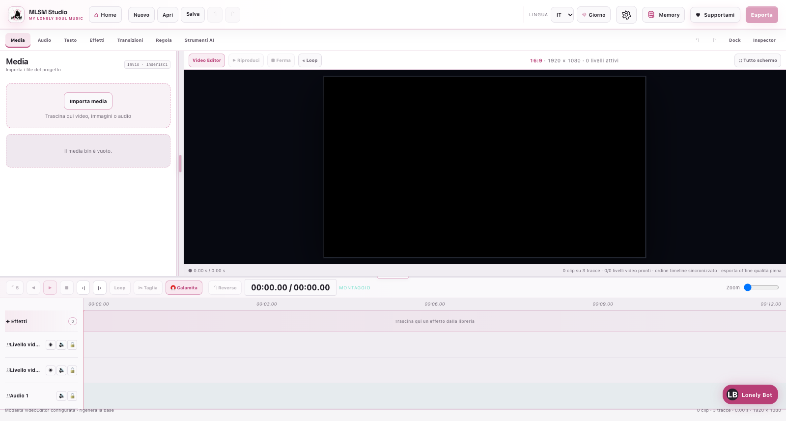
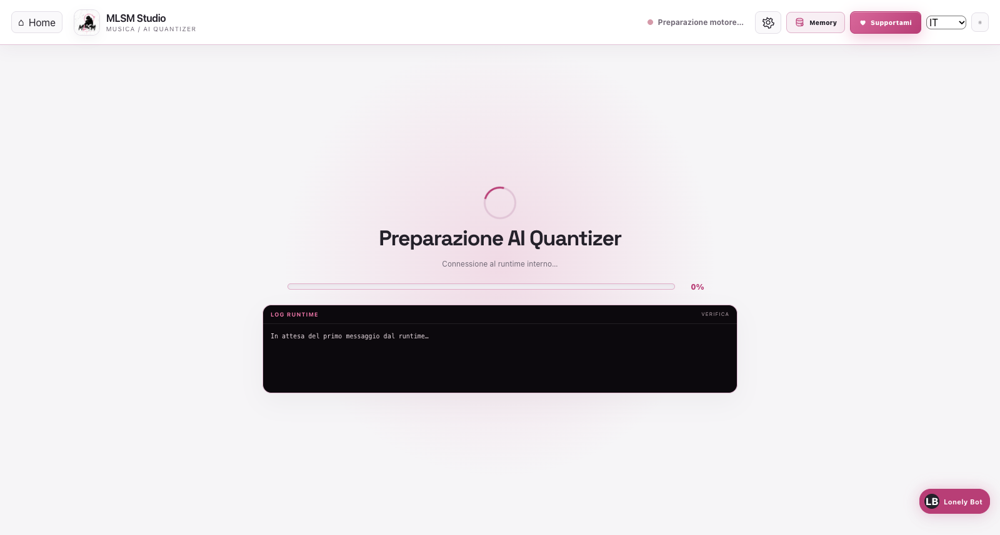
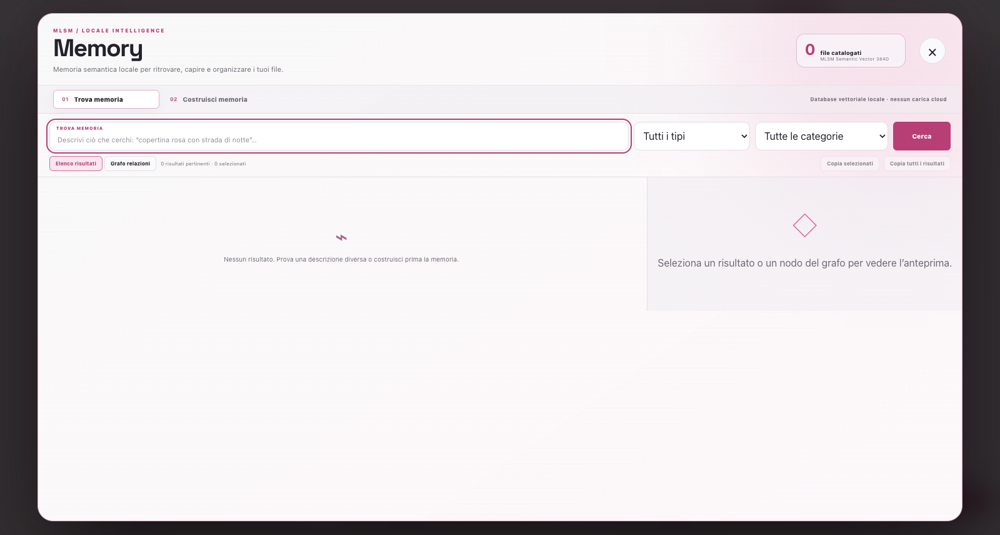
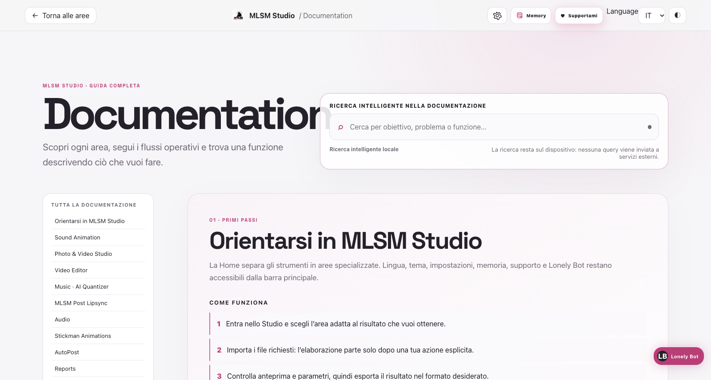

# MLSM Studio

[English](README.md) · **Italiano**


**MLSM Studio — My Lonely Soul Music Studio** è una suite desktop creativa, local-first e multipiattaforma per produrre contenuti audio, video e data-driven in un unico ambiente. Riunisce visualizer audio-reattivi, montaggio multitraccia, restauro e upscaling, elaborazione musicale, trascrizione, lipsync, automazione editoriale e dashboard interattive.

L’applicazione usa un’interfaccia React/Vite dentro una shell Tauri e avvia servizi Python isolati soltanto quando una funzione ne ha bisogno. I media, i progetti, le cache dei modelli e i database applicativi restano sul computer; una connessione esterna viene usata solo per operazioni esplicite come endpoint Gradio/Colab, provider LLM configurati, pubblicazione WordPress, download di modelli o cartografia OpenStreetMap.

> MLSM Studio è un progetto in evoluzione. Prima di lavorare su materiale importante conserva sempre una copia dei file sorgente e verifica l’output finale.

## Indice

- [Panoramica](#panoramica)
- [Aree di lavoro](#aree-di-lavoro)
- [Installazione](#installazione)
- [Primo avvio](#primo-avvio)
- [Flusso di lavoro](#flusso-di-lavoro)
- [Dati, privacy e persistenza](#dati-privacy-e-persistenza)
- [Architettura](#architettura)
- [Sviluppo e test](#sviluppo-e-test)
- [Packaging desktop](#packaging-desktop)
- [Risoluzione dei problemi](#risoluzione-dei-problemi)
- [Documentazione tecnica](#documentazione-tecnica)

## Panoramica

MLSM Studio è progettato attorno a quattro principi:

- **un solo ecosistema:** le diverse aree condividono tema, lingua, gestione dei progetti, Memory e componenti di esportazione;
- **elaborazione locale quando possibile:** FFmpeg, Python, WebAudio, WebCodecs, Metal/MPS, CUDA e CPU vengono selezionati in base al dispositivo e alla modalità;
- **output verificabile:** gli export video vengono ricostruiti offline, frame per frame, invece di registrare la preview in tempo reale;
- **runtime isolati:** le dipendenze Python incompatibili tra loro vivono in ambienti separati e non vengono aggiunte al repository.


### Funzioni principali

| Ambito | Funzioni |
| --- | --- |
| Creazione visuale | Visualizer audio-reattivi, scene 3D, composizioni verticali/orizzontali, sottotitoli cinetici e animazioni narrative. |
| Foto e video | Rimozione watermark autorizzata, upscaling di immagini e video, batch fotografico e incremento del frame rate. |
| Montaggio | Timeline multitraccia, compositing, effetti, transizioni, automazioni, regolazione colore e mix audio. |
| Musica e voce | Quantizzazione, allineamento stem, restauro, mastering, trascrizione Whisper, revisione LLM opzionale e separazione vocale. |
| Dati | Import CSV/TXT/Excel, campi calcolati, filtri, dashboard multi-tab, mappe, pivot e animazioni temporali. |
| Pubblicazione | Coda editoriale WordPress, pianificazione, libreria Spotify/YouTube e statistiche di utilizzo. |
| Memoria locale | Catalogazione semantica e ricerca in linguaggio naturale di file e cartelle senza duplicare gli originali. |

### Galleria

| Sound Animation | Photo & Video Studio |
| --- | --- |
|  |  |

| Video Editor | Music · AI Quantizer |
| --- | --- |
|  |  |

<details>
<summary><strong>Memory · archivio semantico locale</strong></summary>



</details>

## Aree di lavoro

La Home espone dodici aree. Il pulsante **Home** riporta alla selezione senza dover riavviare l’app; **Memory**, **Impostazioni**, lingua e tema sono disponibili dalla barra principale.

### 1. Sound Animation

L’area creativa per visualizer, storie animate e tipografia sincronizzata alla musica.

- visualizer come **Instrumental Falling**, **Cover Sphere**, **Stereo Unfold**, **Cube Animation**, **Overlay Spectral**, **Cassette Desk** e **Song Player**;
- composizione **From 9:16 to 16:9** per trasformare video verticali in layout orizzontali;
- modalità narrative e personaggi come **Teddy Walk** e **Teddy Sing**;
- **Comments Invasion**, **Circular Spectrum Auto Detector**, **Pro Subtitles** e **Pixels Subtitles**;
- analisi di beat, energia, spettro stereo, fonemi e palette;
- preview sincronizzata, timeline e export offline deterministico.

Consulta la guida dedicata: [Sound Animation](docs/sound-animation.md).

### 2. Photo & Video Studio

Strumenti di restauro e miglioramento per fotografie e video.

- **Static Watermark Remover** per contenuti che possiedi o sei autorizzato a modificare, con riferimento fotografico o video pulito sincronizzato e riallineato fotogramma per fotogramma;
- **Upscaler** per foto e video con Canvas Enhanced, Real-ESRGAN e RealESRNet;
- backend locale con selezione automatica CUDA, Metal/MPS o CPU e percorso remoto opzionale Gradio/Colab;
- **MLX-DLSS 5** opzionale su Apple Silicon, con backend Metal isolato e modello NVIDIA importato dall’utente;
- batch di fotografie, confronto prima/dopo, regolazioni colore, fusione con l’originale e risoluzione personalizzata;
- **Frame Booster** con metodi FFmpeg, conservazione dell’audio e verifica di durata, geometria e frame rate.

I pesi proprietari NVIDIA non sono inclusi. La configurazione MLX-DLSS richiede un modello autorizzato, ad esempio `nvngx_dlssnr.dll` per estrarre Neural Rendering; il file viene conservato nel runtime locale e resta fuori da Git.

Consulta la guida dedicata: [Photo & Video Studio](docs/photo-video-studio.md).

### 3. Video Editor

Editor multitraccia con livelli equivalenti e compositing non distruttivo.

- media bin con drag-and-drop per video, immagini e audio;
- spostamento, trim, split, reverse, snap, riordino e blocco delle tracce;
- effetti, transizioni e correzione colore con Inspector contestuale;
- trasformazioni, opacità, blend mode, velocità e curve di automazione;
- mix audio con volume, pan, EQ, compressore, fade e inviluppi;
- export offline con mix audio separato e interpolazione frame opzionale.

Consulta la guida dedicata: [Video Editor](docs/video-editor.md).

### 4. Music · AI Quantizer

Pipeline guidata per preparare master e stem mantenendo il pitch.

Il percorso operativo è **Importa → Quantizza → Allinea → Restauro → Master → Esporta**. Ogni fase deve essere applicata oppure saltata esplicitamente prima di procedere; l’ascolto non parte automaticamente al termine di un’elaborazione.

- rilevamento del tempo e mappa di warp condivisa;
- allineamento DAW senza ripetere la quantizzazione;
- confronto waveform e marker prima/dopo;
- restauro e mastering facoltativi;
- AI Forensics separata dal flusso principale;
- esportazione ZIP con stato e avanzamento visibili.

Consulta la guida dedicata: [Music · AI Quantizer](docs/music.md).

### 5. MLSM POST LIPSYNC

Riallinea un video già cantato alla voce del master definitivo. La pipeline separa la voce, misura la trascrizione temporale, costruisce anchor parola-per-parola e applica una time-map monotona, mantenendo il processo verificabile prima dell’export.

### 6. Audio

Workspace per trascrizione e produzione vocale.

- trascrizione locale di audio e video con modelli Whisper selezionabili;
- scelta della lingua oppure riconoscimento automatico;
- esportazione SRT, VTT, TXT e JSON Whisper completo;
- revisione LLM **disattivata di default**, attivabile solo dopo aver inserito il testo originale;
- revisore locale oppure provider API abilitato nelle Impostazioni;
- separazione della voce dal mix con Demucs `htdemucs` ed export WAV.

### 7. Stickman

Area dedicata alle animazioni grafiche stilizzate. La modalità **Bivio** usa i colori base MLSM (`#FF4F9A`, `#211B1F` e carta/strada bianca), consente di personalizzare scena e testo ed esporta un video verticale a 720p o 1080p, 24 o 30 fps.

### 8. MLSM AutoPost

Automazione editoriale locale per WordPress.

- import o incolla di documenti JSON fino a 500 articoli;
- assegnazione per articolo a uno o più blog e categorie;
- coda persistente, pubblicazione immediata o pianificata, pausa, retry e cancellazione completa;
- gestione multi-sito con Application Password cifrata localmente;
- libreria musicale Spotify/YouTube con priorità, regole, backup e ripristino;
- statistiche sugli embed pubblicati e registro attività.

La pubblicazione usa la rete solo verso i siti WordPress configurati e i provider necessari a mostrare i media.

### 9. Reports

Ambiente visuale in stile BI per costruire dashboard partendo da **CSV, file di testo ed Excel**.

- dataset sostituibili o estendibili tramite append, con gestione dei singoli file sorgente;
- anteprima dati e campi calcolati tramite **MLSM Formula**, anche con formule aggregate come `SUM(a) / SUM(b)`;
- assistenza LLM opzionale alla scrittura delle formule;
- KPI, barre orizzontali e verticali, linee, area, ciambella, dispersione, mappe, tabella, pivot e testo;
- somma, media, conteggio, distinti, mediana, minimo, massimo, intervallo, varianza e deviazione standard;
- formati numerici, percentuali e valute, assi e tick configurabili;
- raggruppamento temporale, ordinamento, prime o ultime N categorie;
- layout a righe, larghezze manuali, numero personalizzato di elementi e dashboard multi-tab;
- filtri globali o associati a widget specifici, con valore iniziale e opzione `(All)` configurabili;
- animazioni **Time Series** e **Corsa delle barre**, per periodo o cumulative;
- salvataggio nell’archivio locale condiviso, import/export JSON e URL di sola visualizzazione;
- export HTML autonomo con codice `iframe` pronto da copiare. Le mappe esportate usano Leaflet e tile OpenStreetMap e richiedono Internet.

### 10. Post-it

Archivio privato di note, link e flussi: i link restano nei dati locali dell’app, non nel repository. I post-it possono essere collegati in sequenze e ricercati semanticamente.

### 11. Streamer Audio Viewer

Workspace di ascolto e analisi audio stereo. Importa più file locali (anche trascinandoli), aggiungi link Spotify o YouTube, riordina la coda e salvala tra i preferiti. L’avanzamento automatico è opzionale: di default la riproduzione si ferma alla fine di ogni brano. Nessun brano parte da solo all’apertura dell’area.

Il lettore locale invia il PCM decodificato direttamente al motore condiviso di analisi; non richiede permessi di cattura. Per analizzare l’audio proveniente da Spotify, YouTube o altre app, seleziona esplicitamente una sorgente di cattura: **ScreenCaptureKit** su macOS, **WASAPI loopback** su Windows dove disponibile. I player ufficiali forniscono riproduzione e metadati, non il PCM; MLSM non scarica né aggira stream protetti. Il microfono non viene attivato automaticamente.

Gli undici moduli includono spettro stereo, peak e true peak, LUFS, immagine stereo, correlazione di fase, spettrogramma, oscilloscopio, dinamica, distribuzione tonale, informazioni del brano e giradischi. Posizione, dimensione e visibilità dei moduli si salvano localmente. Le misure provengono dal segnale audio reale: se non è disponibile, l’interfaccia indica l’attesa del segnale.

La cattura resta attiva solo nell’area Streamer e si interrompe quando si esce o si preme **Ferma cattura**. I dati PCM acquisiti sono analizzati sul dispositivo; non vengono registrati o inviati a servizi esterni. Nel browser la cattura di sistema è una modalità limitata, disponibile soltanto se il browser espone l’audio condiviso.

### 12. Documentation

La guida bilingue integrata descrive le aree, i flussi e le funzioni operative dell’app. La barra di ricerca accetta anche una descrizione libera del risultato desiderato: mostra subito le corrispondenze testuali, quindi le riordina semanticamente con **MiniLM multilingue** locale.

- il modello viene caricato soltanto dopo una ricerca, non all’avvio dell’app;
- WebGPU viene usata quando realmente disponibile, con fallback WASM verificato;
- query e indice restano sul dispositivo e non vengono inviati a provider esterni;
- se il modello non è disponibile, la ricerca lessicale continua a funzionare;
- ogni risultato porta alla sezione o alla funzione pertinente.



## Installazione

### Requisiti di base

Gli installer preparano automaticamente quasi tutto il necessario. Prima di iniziare servono:

| Piattaforma | Requisito iniziale |
| --- | --- |
| macOS | Accesso a Internet e Xcode Command Line Tools. Lo script installa Homebrew se manca. |
| Windows | Windows Package Manager (`winget`), incluso in **App Installer**, e accesso a Internet. |

Il setup installa o verifica:

- Node.js (`>= 22.12`) e le dipendenze npm esatte del lockfile;
- **Python 3.11** e quattro virtual environment isolati;
- FFmpeg e FFprobe;
- Rubber Band;
- Rust/Cargo e dipendenze Tauri;
- CMake e Ninja su macOS;
- WebView2 e Visual Studio Build Tools su Windows.

I modelli AI pesanti non vengono versionati nel repository: vengono scaricati al primo utilizzo quando la licenza lo consente, quindi riutilizzati dalla cache locale.

### macOS

Dalla root del repository:

```bash
bash scripts/macos/install.sh
scripts/macos/launch.sh
```

Se macOS apre l’installazione dei Command Line Tools, completala e rilancia `install.sh`. Le funzioni MLX-DLSS richiedono Xcode completo, il compilatore Metal e una copia autorizzata del modello NVIDIA; non sono necessarie per usare il resto dell’app.

### Windows

Dal Prompt dei comandi:

```bat
scripts\windows\install.bat
scripts\windows\launch.bat
```

Dopo un `git pull`, il launcher confronta automaticamente manifest e lockfile con l’ultima preparazione riuscita. Se le dipendenze sono cambiate esegue `npm ci --include=dev`; se sono cambiati i sorgenti o manca la build esegue `npm run build`. Al primo avvio successivo all’introduzione di questo controllo il marker non esiste ancora: per sicurezza vengono eseguiti entrambi i comandi. Lo stato è salvato soltanto in `node_modules/.cache/mlsm-studio/` e non viene versionato. Se uno dei due comandi fallisce, l’app non viene avviata e resta visibile l’errore reale.

Da PowerShell usa il prefisso `./`:

```powershell
./scripts/windows/install.bat
./scripts/windows/launch.bat
```

Rubber Band viene installato tramite MSYS2 in `C:\msys64\ucrt64\bin`; lo script aggiorna il PATH utente e l’app conosce anche il percorso nativo. Non è necessario creare manualmente `C:\Tools`.

### Verifica dell’installazione

Al termine, oppure per diagnosticare una macchina già configurata:

```bash
npm run install:verify
```

La verifica controlla Node, dipendenze JavaScript, Python 3.11, virtual environment, import Python, FFmpeg/FFprobe, Rubber Band e toolchain richiesta. L’installer mostra il messaggio di completamento solo dopo che questi controlli hanno avuto esito positivo.

### Ripristino mirato

Il pannello **Impostazioni → Restore** verifica prima ogni componente e ripara soltanto i controlli falliti; quelli già pronti vengono saltati. Dalla root del repository puoi vedere il piano senza modificare nulla:

```bash
node tools/repair_installation.cjs --dry-run
```

Per eseguire la riparazione, ometti `--dry-run`:

```bash
node tools/repair_installation.cjs
```

Al termine viene eseguita una nuova verifica. Il comando usa Node direttamente: per riparare i soli ambienti Python non richiede npm e non reinstalla i runtime già pronti. I log mostrano ogni componente saltato, riparato o ancora non disponibile.

## Primo avvio

1. Avvia MLSM Studio con lo script della tua piattaforma.
2. Premi **Entra nello Studio** e scegli un’area dalla Home.
3. Apri **Impostazioni** per selezionare lingua, tema ed eventuali provider LLM.
4. Importa un media o un dataset; l’app prepara il runtime richiesto e mostra lo stato dell’operazione.
5. Per i modelli locali, attendi il download iniziale: gli avvii successivi usano la cache.

L’ambiente di sviluppo è disponibile su `http://localhost:1420` quando viene eseguito `npm run dev`. Build e test non lasciano server attivi.

### Runtime Python

| Runtime | Directory | Responsabilità |
| --- | --- | --- |
| Upscaler | `.venv` | Real-ESRGAN/RealESRNet, immagini, video e coordinamento dei job remoti. |
| AI Quantizer | `.venv-ai-quantizer` | Quantizzazione, allineamento, restauro e mastering. |
| Song Player | `.venv-song-player` | Analisi audio/video e sincronizzazione dedicata. |
| Audio | `.venv-audio-tts` | Whisper, elaborazione vocale e servizi audio. |

Tutti gli ambienti usano Python 3.11 e sono esclusi da Git. I processi locali sono gestiti dall’app e vengono avviati per l’area che li richiede, evitando di occupare risorse durante l’intera sessione.

## Flusso di lavoro

Il percorso cambia in base all’area, ma la struttura generale resta coerente:

1. **Scegli l’area e la modalità.** Il pannello sinistro contiene sorgenti, strumenti e impostazioni raggruppate.
2. **Importa i file.** Gli originali non vengono modificati; il progetto conserva riferimenti e metadati.
3. **Analizza o prepara.** Beat, spettro, trascrizione, modelli e runtime vengono calcolati solo quando necessari.
4. **Configura e verifica.** Usa preview, Inspector, timeline o canvas della dashboard per controllare il risultato.
5. **Esporta.** Scegli formato, rapporto, risoluzione e frame rate quando disponibili.
6. **Controlla il file finale.** Le pipeline offline verificano frame, durata, geometria e audio prima della consegna.

## Dati, privacy e persistenza

MLSM Studio segue un modello **local-first**, non “offline a ogni costo”.

### Cosa resta locale

- progetti, preferenze e cronologia delle attività;
- dashboard Reports e relativi dataset;
- database Memory e percorsi dei file catalogati;
- coda, configurazione e statistiche AutoPost;
- virtual environment, modelli locali, cache e file temporanei;
- credenziali salvate tramite i meccanismi previsti dall’app.

### Quando vengono usati servizi esterni

- download iniziale di dipendenze e modelli;
- endpoint Gradio/Colab scelti nell’Upscaler;
- provider LLM configurati esplicitamente;
- pubblicazione e verifica verso blog WordPress;
- tile OpenStreetMap nelle mappe Reports;
- anteprime o embed di servizi media quando previsti.

Le directory runtime e i dati utente sono ignorati da Git. Non aggiungere manualmente modelli, DLL proprietarie, cache, credenziali, export o database applicativi al repository.

Memory non duplica i file originali: conserva metadati, embedding e percorso assoluto. Se un originale viene spostato o eliminato, il relativo riferimento deve essere aggiornato o rimosso.

## Architettura

```text
MLSM Studio
├── apps/desktop/             React, Vite, Tauri e workspace applicativi
│   ├── src/                  UI, stato, servizi, editor e modalità
│   └── src-tauri/            Shell desktop, comandi nativi e bundle
├── packages/                 Schemi e librerie TypeScript condivise
├── tools/                    Runtime Python/Node e utility operative
├── scripts/
│   ├── macos/                Installazione, avvio e packaging macOS
│   └── windows/              Installazione, avvio e packaging Windows
├── docs/                     Manuali, architettura e note tecniche
├── tests/                    Test di integrazione trasversali
└── assets/, img/, mixamo/    Risorse grafiche e modelli dell’app
```

### Processi principali

| Processo | Ruolo |
| --- | --- |
| React/Vite | Interfaccia, stato, preview, timeline, dashboard e modelli web locali. |
| Tauri | Dialog nativi, filesystem, percorsi applicativi e distribuzione desktop. |
| Servizi Python | Inferenza e pipeline che richiedono librerie native o modelli dedicati. |
| FFmpeg/Rubber Band | Decodifica, encoding, mux, trasformazioni temporali e audio. |
| Worker | Analisi intensive senza bloccare l’interfaccia. |

Zustand separa stato progetto, audio, analisi, scena, export e playback. I media binari restano fuori dal JSON di progetto; il documento conserva impostazioni, timeline, metadati e riferimenti ricollegabili.

## Sviluppo e test

### Avvio rapido

```bash
npm ci --include=dev
npm run dev
```

### Comandi principali

| Comando | Scopo |
| --- | --- |
| `npm run dev` | Avvia l’app in sviluppo e i servizi gestiti richiesti. |
| `npm run build` | Crea la build web senza lasciare server attivi. |
| `npm run typecheck` | Esegue il controllo TypeScript del workspace. |
| `npm run lint` | Esegue ESLint con zero warning ammessi. |
| `npm test` | Esegue la suite Vitest. |
| `npm run test:coverage` | Esegue i test con copertura. |
| `npm run install:verify` | Verifica l’installazione locale. |
| `npm run setup:runtimes` | Prepara tutti e quattro i runtime Python. |
| `npm run rife:verify` | Verifica artifact, runtime e mini inferenza RIFE reale. |

Per preparare o diagnosticare un solo servizio:

```bash
npm run upscaler:setup
npm run upscaler:server
npm run ai-quantizer:setup
npm run ai-quantizer:server
npm run song-player:setup
npm run song-player:worker
npm run audio-tts:setup
```

### Gate consigliati prima di una release

```bash
npm run typecheck
npm run lint
npm test
npm run build
npm run install:verify
```

I warning relativi alla dimensione dei bundle Three.js o AI devono essere valutati, ma non sostituiscono l’esito dei test.

### Rigenerare gli screenshot

Dopo una build aggiornata:

```bash
npm run build
node tools/capture_documentation_screenshots.mjs
```

Lo script usa Chrome headless sul build statico, salva le immagini in `docs/screenshots/` e chiude il processo al termine. Non avvia un server permanente.

## Packaging desktop

### macOS

```bash
npm run package:mac
bash scripts/macos/build.sh --check
```

### Windows

```bat
npm run package:windows
scripts\windows\build.bat --check
```

Gli artefatti vengono creati in:

```text
apps/desktop/src-tauri/target/release/bundle/
```

La distribuzione pubblica richiede firma Apple Developer o Authenticode. Un pacchetto non firmato può essere compilato e testato, ma il sistema operativo può mostrare un avviso di sicurezza.

## Risoluzione dei problemi

| Problema | Controllo consigliato |
| --- | --- |
| L’installazione termina prima del messaggio “pronto” | Riesegui lo script della piattaforma e poi `npm run install:verify`; non ignorare il primo comando fallito. |
| Windows non trova `rubberband` | Usa l’installer MLSM: installa MSYS2/Rubber Band e registra `C:\msys64\ucrt64\bin` senza richiedere `C:\Tools`. |
| Un ambiente usa la versione Python sbagliata | Riesegui l’installer o `npm run setup:runtimes`; gli ambienti non Python 3.11 vengono rigenerati. |
| Il backend AI non risponde | Esci dall’area e rientra, quindi controlla lo stato mostrato dalla UI e `npm run install:verify`. Avvia il servizio manuale solo per diagnosi. |
| CUDA segnala DLL mancanti su Windows | Seleziona il fallback CPU compatibile oppure completa il runtime NVIDIA; l’app non deve forzare `float16` su hardware non supportato. |
| MLX-DLSS non è configurabile | Verifica Apple Silicon, Xcode/Metal e il modello `nvngx_dlssnr.dll` o `.dlssmodel` autorizzato. Il modello non è incluso nel repository. |
| Un export video occupa molto spazio | Libera spazio temporaneo; i workflow offline possono conservare frame o checkpoint finché il risultato non è verificato. |
| Le mappe di un report HTML sono vuote | L’HTML esportato richiede accesso a Leaflet e ai tile OpenStreetMap. |
| Una dashboard non appare su un altro computer | Le dashboard sono locali: esporta il file `.mlsm-report.json` e importalo sull’altra installazione. |

Per dettagli sui tool di piattaforma consulta [Script di installazione e build](scripts/README.md).

## Documentazione tecnica

- [Indice della documentazione](docs/index.md)
- [Manuale utente](docs/user-guide.md)
- [Sound Animation](docs/sound-animation.md)
- [Photo & Video Studio](docs/photo-video-studio.md)
- [Video Editor](docs/video-editor.md)
- [Music · AI Quantizer](docs/music.md)
- [Memory](docs/memory.md)
- [Export offline](docs/export.md)
- [Analisi audio](docs/audio-analysis.md)
- [Modelli AI locali](docs/local-models.md)
- [Formato progetto](docs/project-format.md)
- [Installazione e sviluppo](docs/development.md)
- [Script macOS e Windows](scripts/README.md)
- [Architettura](docs/architecture.md)

## My Lonely Soul Music

- [Sito ufficiale](https://mylonelysoulmusic.altervista.org/) · [Lonely’s Journal](https://mylonelysoulmusic.altervista.org/journal/)
- [YouTube](https://www.youtube.com/@MyLonelySoulMusic) · [Spotify](https://open.spotify.com/intl-it/artist/46IsvOJtw1vXE6nFqHxz3R) · [Apple Music](https://music.apple.com/it/artist/my-lonely-soul-music/6792151463)
- [TikTok](https://www.tiktok.com/@mylonelysoulmusic) · [Instagram](https://www.instagram.com/mylonelysoulmusic/) · [Email](mailto:mylonelysoulmusic@gmail.com)

---

**MLSM Studio** · My Lonely Soul Music Studio
