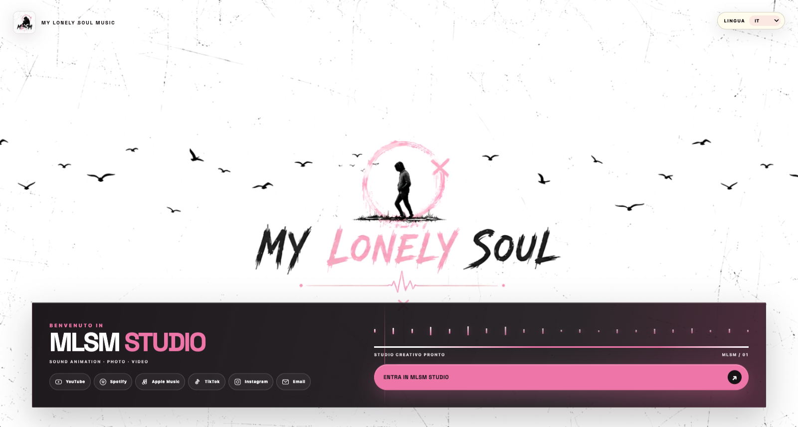
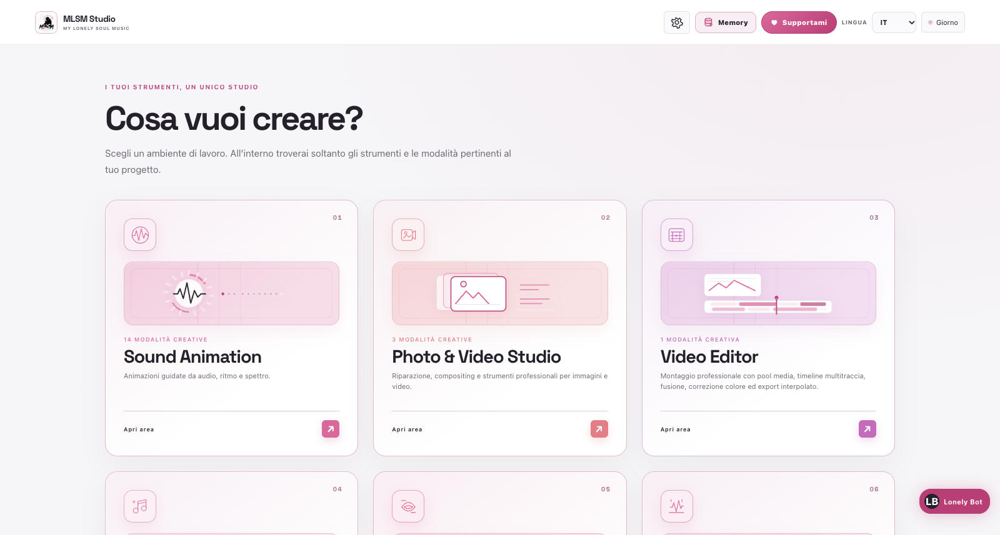

# MLSM Studio



**MLSM Studio — My Lonely Soul Music Studio** è una suite creativa locale per animazioni audio-reattive, sottotitoli, restauro di foto e video, montaggio multitraccia e lavorazione musicale assistita da AI.

I file dell’utente restano sul computer. Le esportazioni video sono offline e deterministiche: ogni frame viene calcolato e verificato prima della consegna, senza registrare la preview in tempo reale.

## Installazione rapida

### macOS

```bash
chmod +x install.sh launch-mlsm.sh
./install.sh
./launch-mlsm.sh
```

### Windows

Dal Prompt dei comandi:

```bat
install.bat
launch-mlsm.bat
```

Gli installer preparano Node.js, Python, FFmpeg, Rust/Tauri, dipendenze npm e ambienti Python isolati. I modelli AI pesanti vengono scaricati soltanto al primo utilizzo del relativo tool e poi riusati dalla cache locale.

Per verificare una macchina senza aprire l’app:

```bash
npm run install:verify
```

## Avvio per sviluppatori

```bash
npm install
npm run dev
```

L’indirizzo predefinito è `http://localhost:1420`. L’avvio è sempre esplicito; build e test non lasciano server attivi.

## Le quattro aree



| Area | Cosa contiene |
| --- | --- |
| **Sound Animation** | Undici modalità per scene 3D, visualizer, storie pixel, orsacchiotti e sottotitoli animati. |
| **Photo & Video Studio** | Rimozione di watermark statici e upscaling AI/Canvas di immagini e video. |
| **Video Editor** | Montaggio multitraccia con livelli equivalenti, effetti, correzione colore e export offline. |
| **Music** | AI Quantizer integrato per quantizzazione, allineamento stem, restauro e analisi forense. |

Il pulsante **Home** riporta sempre alla scelta delle aree. **Memory** apre l’archivio semantico locale; **Supportami** mostra i canali dell’artista; lingua e tema si cambiano dalla barra superiore.

## Flusso essenziale

1. Entra nello Studio e scegli un’area.
2. Seleziona una modalità dal pannello sinistro.
3. Importa i media richiesti dalla modalità.
4. Analizza l’audio quando servono beat, spettro, fonemi o sottotitoli.
5. Regola la scena nella viewport, nell’Inspector e nella timeline.
6. Apri **Esporta**, scegli rapporto, risoluzione e frame rate.
7. Attendi la verifica finale: un file con frame mancanti non viene consegnato.

## Documentazione

- [Indice della documentazione](docs/index.md)
- [Manuale utente](docs/user-guide.md)
- [Sound Animation](docs/sound-animation.md)
- [Photo & Video Studio](docs/photo-video-studio.md)
- [Video Editor](docs/video-editor.md)
- [Music · AI Quantizer](docs/music.md)
- [Memory](docs/memory.md)
- [Export offline](docs/export.md)
- [Installazione e sviluppo](docs/development.md)
- [Architettura](docs/architecture.md)

## Controlli di qualità

```bash
npm run typecheck
npm run lint
npm test
npm run build
```

Gli screenshot del manuale si rigenerano dal build statico, senza server:

```bash
npm run build
node tools/capture_documentation_screenshots.mjs
```

## Pacchetti desktop

```bash
./build-macos.sh          # DMG macOS
./build-macos.sh --check  # sola verifica
```

```bat
build-windows.bat          REM EXE NSIS e MSI
build-windows.bat --check  REM sola verifica
```

Gli artefatti vengono creati in `apps/desktop/src-tauri/target/release/bundle/`. La distribuzione pubblica richiede firma Apple Developer o Authenticode; senza firma il pacchetto è installabile, ma il sistema operativo può mostrare un avviso.

## Dati locali e Git

Modelli, database Memory, file temporanei, progetti AI Quantizer e credenziali sociali non appartengono al repository. Le directory runtime sono escluse da Git e possono essere rigenerate al primo utilizzo.
