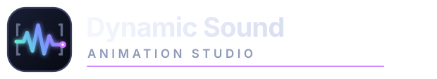

# Dynamic Sound Animation Studio



Studio web locale per creare animazioni professionali sincronizzate alla musica: scene 3D, visualizer, personaggi, lip sync e sottotitoli animati modificabili.

## Requisiti

- Node.js 20.19 o superiore;
- npm 10 o superiore;
- un browser moderno con WebGL 2 e Web Audio API;
- Chrome o Edge aggiornati sono consigliati per l'export diretto del video finale.

Rust, Tauri, Python e FFmpeg non sono necessari per avviare la versione web.

## Installazione

Apri un terminale nella cartella del progetto ed esegui:

```bash
npm install
```

## Avvio in sviluppo

```bash
npm run dev
```

Vite mostrerà l'indirizzo locale dell'applicazione, normalmente:

```text
http://localhost:1420
```

Apri l'indirizzo nel browser. Per arrestare il server usa `Ctrl+C` nel terminale.

L'avvio del server è sempre manuale: nessun passaggio di build o test avvia automaticamente Vite.

## Primo utilizzo

1. Premi **Importa audio** e scegli un file MP3 o WAV.
2. Premi **Analizza** per rilevare BPM, beat, onset e famiglie strumentali.
3. In alto a sinistra scegli la modalità **Instrumental Falling** e abilita le famiglie di elementi che devono comporre la base.
4. Premi **Applica e rigenera base** nel pannello sinistro, oppure **Genera scena** nella barra superiore, per creare un viaggio deterministico prevalentemente orizzontale.
5. Usa i controlli in basso per riprodurre, cercare e modificare i marker.
6. Seleziona gli oggetti dalla viewport o dall'elenco nel pannello destro per modificarli singolarmente.
7. Premi **Salva** per scaricare il progetto `.rbs.json`.
8. Premi **Esporta**, scegli nome e destinazione e attendi il video finale con audio.

Durante la preview premi `Spazio` per alternare play e pausa. La scorciatoia non interviene mentre stai scrivendo in un campo o nella casella delle frasi neon.

L'analizzatore distingue euristicamente grancassa, rullante, piatti, pianoforte, chitarra e violini/strings usando distribuzione spettrale, piattezza, centroide e decadimento. La scena automatica traduce i riconoscimenti in parti professionali di batteria e segue la beat grid principale, non ogni onset; sopra 155 BPM usa un'interpretazione half-time. Tra due oggetti prevalgono i rimbalzi, mentre solo una parte dei passaggi diventa uno scorrimento laterale. I segmenti a bassa energia possono produrre cadute nel vuoto. Il viaggio usa anche la profondità, alternando movimenti in avanti e indietro sull'asse Z; la camera segue la biglia con parallasse e mantiene pochi step contemporaneamente in campo.

Il pannello sinistro descrive la modalità di animazione attiva, non i singoli oggetti già presenti. In **Instrumental Falling** puoi preparare una base normalizzata con grancassa, rullante, tom/tamburo, piatti, pianoforte, corde di chitarra e violino/archi. Ogni famiglia abilitata compare almeno una volta quando il numero di step lo consente; dopo la generazione i singoli elementi vivono nel pannello destro e possono essere sostituiti in tempo reale senza ricreare la viewport.

La seconda modalità, **New York Streets**, genera una vera gara notturna lungo una strada newyorkese e una successiva caduta attraverso un tombino aperto nelle fognature. La camera insegue esclusivamente la biglia principale da dietro; le altre cambiano corsia e passo, sorpassano o restano indietro anche fino a uscire dall'inquadratura. Il rotolamento avviene alla quota reale della carreggiata e ogni concorrente sceglie autonomamente i propri rimbalzi: non esiste una parabola verticale condivisa dal gruppo. Non vengono generati sassolini o detriti; i rari sobbalzi dipendono dalle irregolarità della strada e dagli accenti musicali. La strada continua dietro la partenza, senza vuoti; l'asfalto include aggregato, solchi, rattoppi, crepe geometriche e bump, mentre lampioni, palazzi alti e superfici umide usano materiali e luci PBR.

Nel pannello sinistro di New York Streets puoi scegliere da 1 a 13 sfere secondarie, oltre alla principale. Solo la principale contiene l'immagine configurata in **Scena → Sfera in vetro**. Puoi assegnare un colore comune alle secondarie e poi correggere ogni biglia singolarmente. Durante il percorso le secondarie si rompono progressivamente; prima dell'arrivo resta soltanto la principale, che può eseguire lo stesso finale con rottura, zoom e flip dell'immagine.

Il tombino è un vero foro nella geometria dell'asfalto. Tutte le biglie convergono sull'apertura, cadono verticalmente per `8,2 m` e soltanto allora riprendono la corsa nella fognatura, collocata su un livello nettamente inferiore. Il tunnel è un volume continuo, chiuso e voltato in mattoni umidi, privo di tubi metallici decorativi; l'acqua scorre in un canale laterale in muratura. Nella sezione **Volantini urbani** puoi caricare fino a otto immagini: sulla strada vengono appoggiate direttamente all'asfalto o al marciapiede senza ombre sospese, mentre nelle fognature vengono applicate alle pareti curve. Immagini, numero delle sfere e colori vengono conservati nel progetto. Per maggiori dettagli consulta [New York Streets](docs/new-york-streets.md).

La preview usa automaticamente un carico più leggero: pixel ratio limitato, ombre ridotte e riflessione locale aggiornata meno spesso. L'export usa invece la risoluzione esatta, il frame rate e la qualità selezionati nella finestra **Video finale**. Il renderer web richiede già la GPU ad alte prestazioni disponibile nel browser; su Apple Silicon sfrutta l'accelerazione integrata in macOS e non richiede driver CUDA separati.

Puoi cambiare lo strumento anche selezionando un marker nella timeline e usando **Selezione → Oggetto del rimbalzo**. La geometria, l'altezza di contatto e la traiettoria vengono aggiornate immediatamente; l'override viene associato all'evento musicale. Sia questo menu sia **Nuovo tipo** sull'oggetto mantengono colore, ruvidezza, metallicità, scala e collegamento già personalizzati.

La scheda **Scena** dell'Inspector contiene sempre:

- colori e contenuto interno della sfera, inclusa un’immagine nitida a doppia faccia incorporata nel vetro e solidale alla rotazione;
- finale opzionale con rottura della sfera, zoom e flip dell’immagine in modalità `contain`;
- preset ambientali e caricamento di una foto o di un video personale;
- finitura ambientale limpida oppure usurata;
- estrazione automatica della palette dominante dallo sfondo;
- colori della batteria per tipo e dei singoli elementi; i piatti sono bronzo dorato per default;
- sostituzione del tipo di ogni elemento dalla scheda **Selezione**, mantenendo posizione, scala e collegamento;
- colori e applicazione globale dei collegamenti da flipper, tubi in vetro e mattoncini;
- effetti glow, particelle e vignettatura utilizzabili anche sopra immagini personalizzate.
- insegne neon 3D ripetute lungo il percorso, con più frasi (una per riga) e colore personalizzato.
- una luce PBR personalizzata condivisa dalle due modalità, definita tramite origine e destinazione scelte direttamente nella viewport.

Per combinare più tipi di collegamento, applica prima uno stile globale, seleziona un oggetto nella viewport e scegli il tipo del tratto verso l'oggetto successivo nella scheda **Selezione**. I collegamenti vengono mostrati solo nei tratti di scorrimento: la biglia rimbalza sullo strumento, si appoggia sulla guida flottante e la lascia prima dello step seguente, cadendo sulla pelle. Le discese verticali non hanno binari e curvano sempre davanti agli strumenti, verso la camera. Anche l'ultimo contatto produce un piccolo rebound.

Le superfici degli strumenti includono usura procedurale stabile per oggetto: scocche metalliche sporche sotto il colore scelto, graffi, patina della ferramenta, una zona centrale scura e consumata sulle pelli, tornitura, martellatura e abrasioni radiali sui piatti. Il video finale registra direttamente lo stesso renderer WebGL della preview, quindi conserva geometrie, materiali PBR, rotazione della sfera, camera e neon senza una ricostruzione semplificata.

La sfera usa una sonda di riflessione dinamica nello spazio 3D. Luci di scena, strumenti e insegne neon vengono catturati attorno alla posizione reale della biglia: anche un neon collocato dietro di essa produce luce colorata, riflessi sul vetro e risposta sul rivestimento interno. La sonda viene aggiornata più frequentemente durante l'export e usa una texture HDR dedicata.

In **Scena → Luce direzionale personalizzata** attiva la luce, quindi usa **Scegli nella scena** nelle schede **Origine luce** e **Destinazione luce** e clicca i due punti nella viewport. Le coordinate X/Y/Z restano modificabili manualmente. Sono disponibili colore, intensità, dispersione del cono, morbidezza del bordo, portata, decadimento fisico, ombre, dimensione e visibilità della sorgente, densità ed estensione del fascio e amplificazione dello scintillio sulla biglia. Con **Segui la biglia per tutto il percorso** il vettore fra i due punti viene traslato per ogni fotogramma fino alla posizione corrente della sfera, mantenendo il rig nell'inquadratura lungo l'intera discesa; disattivandolo la luce resta fissa nel mondo. **Attiva per tutto il video** mantiene la luce dal primo all'ultimo frame, oppure può essere sostituito da un intervallo preciso di secondi. La luce combina una `SpotLight` fisica ad alta intensità, una componente di spill morbido e un volume conico trasparente a doppio strato con piani interni di scattering: modifica tutti i materiali PBR, proietta ombre e rimane leggibile anche in presenza degli elementi generati. Sulla sfera genera un highlight calcolato da sorgente, superficie e camera. Quando l'analisi ricostruisce il percorso, origine e destinazione vengono traslate insieme al nuovo riferimento iniziale invece di rimanere nelle vecchie coordinate. Configurazione, intervallo e trasformazione dinamica vengono usati dallo stesso renderer durante preview ed export.

Sugli impatti, grancassa, rullante e tom producono una vibrazione breve e smorzata con una lieve compressione della pelle. I piatti oscillano invece sul proprio supporto come dopo una bacchettata, con inclinazione e decadimento più lunghi. Queste reazioni usano il tempo assoluto del contatto e sono identiche in preview ed export.

In **Scena → Sfondo e ambiente** puoi caricare JPG, PNG, WebP, MP4, WebM oppure Ogg. I video sono silenziosi, in loop e sincronizzati alla posizione audio; il primo fotogramma determina la palette automatica e i fotogrammi corretti vengono usati nel video finale. Nello stesso pannello puoi attivare i neon, scrivere più frasi su righe separate e scegliere il colore: il testo viene alternato e ripetuto sullo sfondo nello spazio 3D.

Nella timeline i marker pieni indicano i rimbalzi, quelli sottili gli scorrimenti e quelli a rombo le cadute nel vuoto. I piccoli pulsanti `+` sulla corsia Beat aggiungono uno strumento dove manca. Usa `Shift`, `Cmd` su macOS o `Ctrl` su Windows/Linux per mantenere più marker selezionati; quindi premi **Elimina N** oppure `Canc/Backspace` per rimuoverli insieme. Il percorso restante viene ricollegato e la biglia continua sui binari.

**Applica e rigenera base** è ora non distruttivo per l'aspetto: conserva gli identificativi lungo il percorso e riapplica colori per tipo e per singolo elemento, materiali, scala e binari. Serve soltanto per ricostruire la distribuzione generale della modalità, non per rendere visibile una sostituzione locale.

Per il finale, carica un’immagine in **Scena → Sfera in vetro** e attiva **Rottura cinematografica**. Puoi romperla alla fine del brano, scegliendo da 0 a 10 secondi di permanenza dell’immagine dopo la musica, oppure a un secondo o a una battuta precisa. Il finale usa frammenti irregolari, flash, oscuramento, zoom e flip ed è incluso nel video.

La modalità **Cover Sphere Visualizer** si seleziona dal menu in alto a sinistra. Carica la copertina nel relativo pannello: il flag **Colori automatici dalla cover** applica e mantiene la palette sulle 48 bande e sugli effetti, mentre la sfera centrale ruota sul brano. Disattivando il flag i due colori diventano manuali; riattivandolo viene ripristinata immediatamente l’ultima palette estratta. Dallo stesso pannello puoi attivare fumo, particelle, foglie al vento, pioggia e volantini caricati dall’utente; foto e video di sfondo restano configurabili in **Scena → Sfondo e ambiente**.

La modalità **Stereo Unfold** trasforma la cover in un foglio fisico PBR: entra dall’alto fortemente stropicciato, atterra con inerzia e si dispiega senza diventare perfettamente piatto. Le pieghe residue modificano geometria, normali, riflessi e ombre; durata dell’ingresso e quantità di stropicciatura restano configurabili. Dietro la cover si apre un campo stereofonico con tre direzioni artistiche — **Nastri luminosi**, **Prismi di frequenza** e **Aurora stereofonica** — oltre a profondità, intensità e bagliore regolabili.

L’analizzatore conserva 48 bande, RMS e differenza spettrale separatamente per canale sinistro e destro. I due lati del visualizer reagiscono quindi al contenuto L/R reale e non a una copia specchiata; i file mono passano automaticamente a una composizione simmetrica. Il caricamento della cover estrae due colori dominanti per i canali e per i sottotitoli collegati, mantenendo il flag per sbloccare la palette manuale. Preview ed export usano la stessa deformazione deterministica calcolata sul tempo audio assoluto.

**New York Streets** non viene più proposta nel selettore delle modalità. Il relativo formato dati e il renderer restano disponibili soltanto per aprire senza perdita i progetti precedenti.

La modalità **Teddy Walk** mostra un orsacchiotto vissuto con peluria geometrica e tessuto irregolare, scolorito, abraso e leggermente sporco che cammina lentamente, sempre di mezzo profilo e senza saltelli, su una strada PBR con asfalto granuloso, crepe, colature, riparazioni, rappezzi e segnaletica consumata. La cover caricata viene incorporata nello squarcio cucito sul petto e pulsa morbidamente con il brano. Il pannello sinistro permette di estrarre e modificare la palette di pelo, toppe, dettagli e asfalto, regolare passo e pulsazione e attivare `Balla mentre cammina`: la coreografia elimina la deriva laterale, solleva le braccia, esegue giri completi e aggiunge piccoli salti atletici sincronizzati. L’animazione usa il tempo audio assoluto anche durante l’export; i vecchi progetti Teddy Wheel vengono convertiti automaticamente.

I file FBX in `apps/desktop/src/assets/mixamo` vengono incorporati nella build e riprodotti con retargeting geometrico. Le direzioni reali di braccia e gambe vengono adattate alle proporzioni dell’orsacchiotto, con limiti anatomici, margine anticollisione dal busto e continuità dei quaternion. `Walking` è adattata a quattro beat; le clip Hip Hop, Silly Dance e Jump occupano finestre più lunghe con dissolvenze, per mantenere gesti lenti e leggibili. Le clip sono precampionate a 60 Hz e poi interpolate linearmente, evitando micro-arresti tra i frame. La traslazione orizzontale originale viene rimossa perché l’avanzamento è già rappresentato dallo scorrimento della strada; la quota del bacino viene mantenuta entro limiti sicuri per garantire salti e atterraggi senza attraversare l’asfalto.

La modalità **Teddy Sing** riutilizza lo stesso orsacchiotto con il nuovo pelo condiviso da tutte le modalità Teddy: sottopelo fitto e morbido, fibre esterne corte e curve e variazioni cromatiche molto leggere, senza ciuffi radi e appuntiti. Sotto la peluria, la mappa PBR mostra trama tessile consumata, aree scolorite, sporco assorbito e piccole abrasioni. Il peluche è seduto a terra, afflosciato e asimmetrico contro la parete; la ripresa è un primo piano dal basso. La stanza moderna PBR usa pavimento materico, pannelli, LED, luci reali e particelle atmosferiche configurabili per colore e densità. La cover caricata viene mostrata per intero come poster fisico incorniciato, in alto dietro l’orso; la palette estratta controlla pelo, toppe, stanza e LED.

Il labiale di Teddy Sing è applicato al modello 3D: analizza intensità, attacchi e bande formantiche e controlla separatamente mandibola, cavità orale, labbro superiore, labbro inferiore, denti e lingua. Per il risultato più preciso importa e analizza una traccia vocale isolata; anche il mix completo è supportato, ma strumenti molto presenti possono produrre falsi attacchi. Dopo l’analisi compare la corsia **Fonemi** nella timeline: un fonema si seleziona con un clic, si divide al playhead con **Dividi** (oppure con doppio clic nel punto desiderato) e si elimina con **Elimina fonema**, `Backspace` o `Delete`. Eliminandolo la bocca resta chiusa in quell’intervallo; ogni fonema ha un rilascio morbido e alla fine del brano il muso torna sempre alla posa neutra. Le divisioni e le eliminazioni vengono applicate allo stesso lipsync usato nell’export.

I pulsanti `9:16` e `16:9` cambiano la cornice effettiva della preview e causano il ridimensionamento del renderer WebGL nel formato scelto.

L'esportazione registra in tempo reale la stessa scena mostrata nella preview e aggiunge l'audio. Il browser sceglie automaticamente MP4 H.264/AAC quando disponibile, altrimenti WebM VP9/Opus. Nel dialogo puoi scegliere **Massima** (predefinita, fino a 160 Mbit/s) oppure **Alta**; la stima della dimensione si aggiorna in base alla scelta. L'audio viene richiesto a 320 kbit/s ma, durante l'export, è instradato soltanto nel registratore e non nelle cuffie o negli altoparlanti. Il compositing conserva la gestione colore AgX della preview, usa vignettatura molto tenue e non applica filtri opachi aggiuntivi. Nei browser compatibili i chunk vengono scritti direttamente nel file finale scelto dall’utente, evitando di duplicare il video nella quota privata del browser. La cartella temporanea viene usata soltanto come fallback, ripulendo eventuali export incompleti.

La sezione **Sottotitoli globali** è disponibile nel pannello sinistro in ogni modalità. Incolla il testo ufficiale, scegli una lunghezza indicativa e avvia la generazione: il numero di parole è un obiettivo morbido, mentre pause vocali, punteggiatura, durata massima, due righe e velocità di lettura governano realmente i tagli. Il selettore offre **Whisper Tiny**, **Base** e **Medium** locali; se Whisper restituisce più parole in un singolo chunk, il programma ridistribuisce correttamente i timestamp interni invece di trattarlo come una frase lunghissima. Il testo ufficiale corregge soltanto parole allineabili e non viene mai spalmato proporzionalmente su sezioni non pronunciate.

Il pannello **Consiglio LLM locale multi-agente** usa SmolLM2 e permette da uno a dieci turni. Editor del testo, montatore del timing, controllo qualità e coordinatore condividono la stessa conversazione e leggono i rapporti precedenti. Il modello propone e verifica; un montatore deterministico conserva l’autorità sui timestamp, chiude ogni blocco vicino all’ultima parola pronunciata e rifiuta durata, sovrapposizione, ingombro o velocità di lettura fuori specifica. Il comando di revisione rimonta anche blocchi già presenti usando questi stessi vincoli.

I pesi quantizzati di Whisper e SmolLM2 non sono inclusi nel repository o nella build. Il modello selezionato viene scaricato da Hugging Face soltanto al primo utilizzo e conservato nella cache locale persistente del WebView; gli utilizzi successivi funzionano dalla cache senza ripetere il download. Il primo utilizzo richiede quindi una connessione e mostra l’avanzamento. Dettagli e repository verificati sono in [Modelli AI locali](docs/local-models.md). In **Cover Sphere Visualizer**, il flag **Colori automatici dalla cover** applica la palette estratta anche al colore e al bagliore dei sottotitoli; il rendering usa il colore reale, senza fusione additiva che lo trasformi in bianco. Sono disponibili sei font locali e cinque animazioni: **LED in caduta**, **Dissolvenza cinematografica**, **Word Pop**, **Karaoke Glow** e **Slide Up**. Le frasi diventano blocchi indipendenti nella corsia **Sottotitoli** e possono essere trascinate, divise, eliminate e modificate. Il pulsante **Esporta SRT** produce un file standard separato.

La corsia **Sottotitoli** resta visibile anche quando è vuota. Puoi inserire un blocco al playhead con **+ Sottotitolo**, con **Inserisci blocco al playhead** nel pannello oppure facendo doppio clic sulla corsia. La sezione **Blocchi manuali e libreria** salva l’intera traccia insieme a timestamp, animazione, font, dimensione e colori in una libreria locale indipendente dal progetto. Una traccia salvata può sostituire quella corrente mantenendo i tempi, adattarsi proporzionalmente alla durata di un altro video oppure essere inserita dal playhead senza eliminare i blocchi presenti. La libreria è disponibile in tutte le modalità e nei nuovi progetti; può inoltre essere esportata e importata come `dynamic-sound-subtitles.json`.

La modalità **Add Subtitles** importa direttamente un video MP4, WebM, MOV o M4V, ne usa l’audio come clock principale e mostra soltanto i controlli pertinenti: video, formato, adattamento `cover/contain`, oscuramento e sottotitoli. Strumenti, sfera, illuminazione di scena e generatori 3D restano nascosti. Preview ed export condividono lo stesso fotogramma video e la stessa animazione dei sottotitoli.

In basso a destra è disponibile **Assistente Studio**, una chat di aiuto che usa
SmolLM2, scaricato e memorizzato localmente al primo utilizzo. Il bot recupera dalla knowledge base soltanto
le guide pertinenti alla domanda e conosce modalità attiva, formato, presenza
dell’audio e stato dell’analisi. Nessun testo viene inviato online. Se il runtime
WebGPU/WASM non è disponibile, la chat continua a rispondere direttamente dalla
knowledge base locale. La struttura e le regole di manutenzione sono descritte
in [Knowledge base dell’assistente locale](docs/assistant-knowledge-base.md).

## Build web di produzione

```bash
npm run build
```

I file statici vengono generati in:

```text
apps/desktop/dist
```

Per provarli localmente:

```bash
npm exec vite preview --workspace @rbs/desktop
```

## Controlli di qualità

```bash
npm run typecheck
npm run lint
npm test
npm run build
```

Per eseguire i test mentre modifichi il codice:

```bash
npm run test:watch
```

Per generare il report di copertura:

```bash
npm run test:coverage
```

## Risoluzione dei problemi

### La porta 1420 è occupata

Chiudi l'altro processo che utilizza la porta oppure avvia Vite su una porta diversa:

```bash
npm run dev --workspace @rbs/desktop -- --port 1421
```

### La viewport 3D non appare

Verifica che WebGL 2 e l'accelerazione hardware siano abilitati nel browser. Aggiorna inoltre i driver della GPU e prova Chrome, Edge o Firefox.

### Il progetto caricato non riproduce l'audio

Per ragioni di sicurezza il browser non può riaprire automaticamente un file audio locale. Dopo aver caricato un progetto JSON, importa nuovamente il relativo MP3 o WAV.

### L'analisi sembra bloccata

L'analisi avviene in un Web Worker. Con brani lunghi può richiedere tempo, ma l'interfaccia dovrebbe restare utilizzabile. Ricarica la pagina se il file è corrotto o il browser termina il worker per memoria insufficiente.

### L'export non parte

Usa Chrome o Edge aggiornato, consenti al browser di salvare il file e verifica che MediaRecorder e l'accelerazione hardware siano disponibili. La registrazione dura quanto il brano; per 4K o 120 fps serve una GPU adeguata. Se MP4 non è supportato dal browser, l'app produce automaticamente WebM.

## Stato della versione

Lo sviluppo è web-first. L'app esporta già un video finale con audio usando le capacità del browser; una futura compilazione desktop con FFmpeg potrà aggiungere codec professionali e rendering offline più veloce, ma verrà valutata solo alla fine.

Per ulteriori dettagli consulta [lo stato dell'MVP web](docs/web-mvp-status.md) e [la documentazione di sviluppo](docs/development.md).
