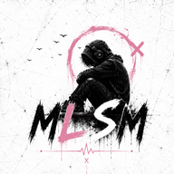

# MLSM Studio



**My Lonely Soul Music Studio** è uno studio web locale per creare animazioni professionali sincronizzate alla musica: scene 3D, visualizer, personaggi, lip sync, sottotitoli animati e strumenti per foto e video.

## Requisiti

- Node.js 20.19 o superiore;
- npm 10 o superiore;
- un browser moderno con WebGL 2 e Web Audio API;
- Chrome o Edge aggiornati sono consigliati per l'export diretto del video finale.

Rust, Tauri, Python e FFmpeg non sono necessari per avviare la versione web.

## Installazione

Apri un terminale nella cartella del progetto ed esegui:

```bash
npm install
```

## Avvio in sviluppo

```bash
npm run dev
```

Vite mostrerà l'indirizzo locale dell'applicazione, normalmente:

```text
http://localhost:1420
```

Apri l'indirizzo nel browser. Per arrestare il server usa `Ctrl+C` nel terminale.

L'avvio del server è sempre manuale: nessun passaggio di build o test avvia automaticamente Vite.

## Primo utilizzo

1. Premi **Importa audio** e scegli un file MP3 o WAV.
2. Premi **Analizza** per rilevare BPM, beat, onset e famiglie strumentali.
3. In alto a sinistra scegli la modalità **Instrumental Falling** e abilita le famiglie di elementi che devono comporre la base.
4. Premi **Applica e rigenera base** nel pannello sinistro, oppure **Genera scena** nella barra superiore, per creare un viaggio deterministico prevalentemente orizzontale.
5. Usa i controlli in basso per riprodurre, cercare e modificare i marker.
6. Seleziona gli oggetti dalla viewport o dall'elenco nel pannello destro per modificarli singolarmente.
7. Premi **Salva** per scaricare il progetto `.rbs.json`.
8. Premi **Esporta**, scegli nome e destinazione e attendi il video finale con audio.

Durante la preview premi `Spazio` per alternare play e pausa. La scorciatoia non interviene mentre stai scrivendo in un campo o nella casella delle frasi neon.

I pannelli laterali sono ridimensionabili trascinando i due separatori verticali: ciascun pannello può variare da 180 a 480 px, mentre la viewport conserva sempre una larghezza minima utilizzabile. La scelta viene salvata nel browser; doppio clic sul separatore ripristina la misura iniziale e le frecce permettono una regolazione accessibile da tastiera. Nella barra della viewport, **Tutto schermo** mostra soltanto l’animazione; **Torna all’editor** oppure `Esc` ripristinano l’interfaccia completa.

L’interfaccia usa esclusivamente la palette del prodotto: bianco, nero e rosa, invertendo bianco e nero fra modalità Giorno e Notte. Anche Assistente Studio e i pannelli meno recenti ereditano queste variabili. Le modalità con una palette iniziale esplicita a tre colori, fra cui Pixels Subtitles e Pro Subtitles, partono da nero `#000000`, bianco `#ffffff` e rosa `#ed75a7`; il caricamento di una cover può poi sostituirli tramite l’estrazione automatica.

L'analizzatore distingue euristicamente grancassa, rullante, piatti, pianoforte, chitarra e violini/strings usando distribuzione spettrale, piattezza, centroide e decadimento. La scena automatica traduce i riconoscimenti in parti professionali di batteria e segue la beat grid principale, non ogni onset; sopra 155 BPM usa un'interpretazione half-time. Tra due oggetti prevalgono i rimbalzi, mentre solo una parte dei passaggi diventa uno scorrimento laterale. I segmenti a bassa energia possono produrre cadute nel vuoto. Il viaggio usa anche la profondità, alternando movimenti in avanti e indietro sull'asse Z; la camera segue la biglia con parallasse e mantiene pochi step contemporaneamente in campo.

Il pannello sinistro descrive la modalità di animazione attiva, non i singoli oggetti già presenti. In **Instrumental Falling** puoi preparare una base normalizzata con grancassa, rullante, tom/tamburo, piatti, pianoforte, corde di chitarra e violino/archi. Ogni famiglia abilitata compare almeno una volta quando il numero di step lo consente; dopo la generazione i singoli elementi vivono nel pannello destro e possono essere sostituiti in tempo reale senza ricreare la viewport.

La seconda modalità, **New York Streets**, genera una vera gara notturna lungo una strada newyorkese e una successiva caduta attraverso un tombino aperto nelle fognature. La camera insegue esclusivamente la biglia principale da dietro; le altre cambiano corsia e passo, sorpassano o restano indietro anche fino a uscire dall'inquadratura. Il rotolamento avviene alla quota reale della carreggiata e ogni concorrente sceglie autonomamente i propri rimbalzi: non esiste una parabola verticale condivisa dal gruppo. Non vengono generati sassolini o detriti; i rari sobbalzi dipendono dalle irregolarità della strada e dagli accenti musicali. La strada continua dietro la partenza, senza vuoti; l'asfalto include aggregato, solchi, rattoppi, crepe geometriche e bump, mentre lampioni, palazzi alti e superfici umide usano materiali e luci PBR.

Nel pannello sinistro di New York Streets puoi scegliere da 1 a 13 sfere secondarie, oltre alla principale. Solo la principale contiene l'immagine configurata in **Scena → Sfera in vetro**. Puoi assegnare un colore comune alle secondarie e poi correggere ogni biglia singolarmente. Durante il percorso le secondarie si rompono progressivamente; prima dell'arrivo resta soltanto la principale, che può eseguire lo stesso finale con rottura, zoom e flip dell'immagine.

Il tombino è un vero foro nella geometria dell'asfalto. Tutte le biglie convergono sull'apertura, cadono verticalmente per `8,2 m` e soltanto allora riprendono la corsa nella fognatura, collocata su un livello nettamente inferiore. Il tunnel è un volume continuo, chiuso e voltato in mattoni umidi, privo di tubi metallici decorativi; l'acqua scorre in un canale laterale in muratura. Nella sezione **Volantini urbani** puoi caricare fino a otto immagini: sulla strada vengono appoggiate direttamente all'asfalto o al marciapiede senza ombre sospese, mentre nelle fognature vengono applicate alle pareti curve. Immagini, numero delle sfere e colori vengono conservati nel progetto. Per maggiori dettagli consulta [New York Streets](docs/new-york-streets.md).

La preview usa automaticamente un carico più leggero: pixel ratio limitato, ombre ridotte e riflessione locale aggiornata meno spesso. L'export usa invece la risoluzione esatta, il frame rate e la qualità selezionati nella finestra **Video finale**. Il renderer web richiede già la GPU ad alte prestazioni disponibile nel browser; su Apple Silicon sfrutta l'accelerazione integrata in macOS e non richiede driver CUDA separati.

Puoi cambiare lo strumento anche selezionando un marker nella timeline e usando **Selezione → Oggetto del rimbalzo**. La geometria, l'altezza di contatto e la traiettoria vengono aggiornate immediatamente; l'override viene associato all'evento musicale. Sia questo menu sia **Nuovo tipo** sull'oggetto mantengono colore, ruvidezza, metallicità, scala e collegamento già personalizzati.

La scheda **Scena** dell'Inspector contiene sempre:

- colori e contenuto interno della sfera, inclusa un’immagine nitida a doppia faccia incorporata nel vetro e solidale alla rotazione;
- finale opzionale con rottura della sfera, zoom e flip dell’immagine in modalità `contain`;
- preset ambientali e caricamento di una foto o di un video personale;
- finitura ambientale limpida oppure usurata;
- estrazione automatica della palette dominante dallo sfondo;
- colori della batteria per tipo e dei singoli elementi; i piatti sono bronzo dorato per default;
- sostituzione del tipo di ogni elemento dalla scheda **Selezione**, mantenendo posizione, scala e collegamento;
- colori e applicazione globale dei collegamenti da flipper, tubi in vetro e mattoncini;
- effetti glow, particelle e vignettatura utilizzabili anche sopra immagini personalizzate.
- insegne neon 3D ripetute lungo il percorso, con più frasi (una per riga) e colore personalizzato.
- una luce PBR personalizzata condivisa dalle due modalità, definita tramite origine e destinazione scelte direttamente nella viewport.

Per combinare più tipi di collegamento, applica prima uno stile globale, seleziona un oggetto nella viewport e scegli il tipo del tratto verso l'oggetto successivo nella scheda **Selezione**. I collegamenti vengono mostrati solo nei tratti di scorrimento: la biglia rimbalza sullo strumento, si appoggia sulla guida flottante e la lascia prima dello step seguente, cadendo sulla pelle. Le discese verticali non hanno binari e curvano sempre davanti agli strumenti, verso la camera. Anche l'ultimo contatto produce un piccolo rebound.

Le superfici degli strumenti includono usura procedurale stabile per oggetto: scocche metalliche sporche sotto il colore scelto, graffi, patina della ferramenta, una zona centrale scura e consumata sulle pelli, tornitura, martellatura e abrasioni radiali sui piatti. Il video finale registra direttamente lo stesso renderer WebGL della preview, quindi conserva geometrie, materiali PBR, rotazione della sfera, camera e neon senza una ricostruzione semplificata.

La sfera usa una sonda di riflessione dinamica nello spazio 3D. Luci di scena, strumenti e insegne neon vengono catturati attorno alla posizione reale della biglia: anche un neon collocato dietro di essa produce luce colorata, riflessi sul vetro e risposta sul rivestimento interno. La sonda viene aggiornata più frequentemente durante l'export e usa una texture HDR dedicata.

In **Scena → Luce direzionale personalizzata** attiva la luce, quindi usa **Scegli nella scena** nelle schede **Origine luce** e **Destinazione luce** e clicca i due punti nella viewport. Le coordinate X/Y/Z restano modificabili manualmente. Sono disponibili colore, intensità, dispersione del cono, morbidezza del bordo, portata, decadimento fisico, ombre, dimensione e visibilità della sorgente, densità ed estensione del fascio e amplificazione dello scintillio sulla biglia. Con **Segui la biglia per tutto il percorso** il vettore fra i due punti viene traslato per ogni fotogramma fino alla posizione corrente della sfera, mantenendo il rig nell'inquadratura lungo l'intera discesa; disattivandolo la luce resta fissa nel mondo. **Attiva per tutto il video** mantiene la luce dal primo all'ultimo frame, oppure può essere sostituito da un intervallo preciso di secondi. La luce combina una `SpotLight` fisica ad alta intensità, una componente di spill morbido e un volume conico trasparente a doppio strato con piani interni di scattering: modifica tutti i materiali PBR, proietta ombre e rimane leggibile anche in presenza degli elementi generati. Sulla sfera genera un highlight calcolato da sorgente, superficie e camera. Quando l'analisi ricostruisce il percorso, origine e destinazione vengono traslate insieme al nuovo riferimento iniziale invece di rimanere nelle vecchie coordinate. Configurazione, intervallo e trasformazione dinamica vengono usati dallo stesso renderer durante preview ed export.

Sugli impatti, grancassa, rullante e tom producono una vibrazione breve e smorzata con una lieve compressione della pelle. I piatti oscillano invece sul proprio supporto come dopo una bacchettata, con inclinazione e decadimento più lunghi. Queste reazioni usano il tempo assoluto del contatto e sono identiche in preview ed export.

In **Scena → Sfondo e ambiente** puoi caricare JPG, PNG, WebP, MP4, WebM oppure Ogg. I video sono silenziosi, in loop e sincronizzati alla posizione audio; il primo fotogramma determina la palette automatica e i fotogrammi corretti vengono usati nel video finale. Nello stesso pannello puoi attivare i neon, scrivere più frasi su righe separate e scegliere il colore: il testo viene alternato e ripetuto sullo sfondo nello spazio 3D.

Nella timeline i marker pieni indicano i rimbalzi, quelli sottili gli scorrimenti e quelli a rombo le cadute nel vuoto. I piccoli pulsanti `+` sulla corsia Beat aggiungono uno strumento dove manca. Usa `Shift`, `Cmd` su macOS o `Ctrl` su Windows/Linux per mantenere più marker selezionati; quindi premi **Elimina N** oppure `Canc/Backspace` per rimuoverli insieme. Il percorso restante viene ricollegato e la biglia continua sui binari.

**Applica e rigenera base** è ora non distruttivo per l'aspetto: conserva gli identificativi lungo il percorso e riapplica colori per tipo e per singolo elemento, materiali, scala e binari. Serve soltanto per ricostruire la distribuzione generale della modalità, non per rendere visibile una sostituzione locale.

Per il finale, carica un’immagine in **Scena → Sfera in vetro** e attiva **Rottura cinematografica**. Puoi romperla alla fine del brano, scegliendo da 0 a 10 secondi di permanenza dell’immagine dopo la musica, oppure a un secondo o a una battuta precisa. Il finale usa frammenti irregolari, flash, oscuramento, zoom e flip ed è incluso nel video.

La modalità **Cover Sphere Visualizer** si seleziona dal menu in alto a sinistra. Carica la copertina nel relativo pannello: il flag **Colori automatici dalla cover** applica e mantiene la palette sulle 48 bande e sugli effetti, mentre la sfera centrale ruota sul brano. Disattivando il flag i due colori diventano manuali; riattivandolo viene ripristinata immediatamente l’ultima palette estratta. Dallo stesso pannello puoi attivare fumo, particelle, foglie al vento, pioggia e volantini caricati dall’utente; foto e video di sfondo restano configurabili in **Scena → Sfondo e ambiente**.

La modalità **Stereo Unfold** trasforma la cover in un foglio fisico PBR: entra dall’alto fortemente stropicciato, atterra con inerzia e si dispiega senza diventare perfettamente piatto. Le pieghe residue modificano geometria, normali, riflessi e ombre; durata dell’ingresso e quantità di stropicciatura restano configurabili. Dietro la cover si apre un campo stereofonico con tre direzioni artistiche — **Nastri luminosi**, **Prismi di frequenza** e **Aurora stereofonica** — oltre a profondità, intensità e bagliore regolabili.

L’analizzatore conserva 48 bande, RMS e differenza spettrale separatamente per canale sinistro e destro. I due lati del visualizer reagiscono quindi al contenuto L/R reale e non a una copia specchiata; i file mono passano automaticamente a una composizione simmetrica. Il caricamento della cover estrae due colori dominanti per i canali e per i sottotitoli collegati, mantenendo il flag per sbloccare la palette manuale. Preview ed export usano la stessa deformazione deterministica calcolata sul tempo audio assoluto.

La modalità **Cube Animation** applica l’immagine caricata, senza ritagli, a tutte le sei facce di un unico cubo sospeso al centro. Non genera piani d’appoggio, percorsi, rimbalzi, copie o split: i beat analizzati producono rotazioni tridimensionali su assi combinati X/Y/Z con accelerazione e frenata smussate. La cover usa un livello fotografico non illuminato e non tonemappato per conservarne luminosità e saturazione; il guscio separato aggiunge vetro PBR neutro, trasmissione ottica, bordo Fresnel, clearcoat, ambiente riflesso e tre luci dedicate. È possibile caricare una fotografia di sfondo, adattata in modalità cover e regolabile nell’oscuramento. La palette estratta dalla cover governa spettrogramma, increspature d’acqua propagate sui beat, alone, anelli orbitali, particelle, light sweep e luci; riattivando la palette automatica i colori vengono ricalcolati dall’immagine corrente. In basso compare uno spettrogramma a 48 bande con indicatori di picco e intensità regolabile. Orientamento ed effetti coincidono tra `t=0` e la durata finale, così il video può essere ripetuto senza salto.

In **Pixel Art → Walking Through New York** una fascia fissa sul bordo inferiore mostra sempre un deck audio pixelato: 48 bande separate L/R, picchi, colori della cover e un vectorscope che rappresenta l’ampiezza stereo del brano. Il deck è composto nello stesso canvas della storia, quindi compare identico nella preview e nell’esportazione sia in strada sia dentro il locale.

**New York Streets** non viene più proposta nel selettore delle modalità. Il relativo formato dati e il renderer restano disponibili soltanto per aprire senza perdita i progetti precedenti.

La modalità **Teddy Walk** mostra un orsacchiotto vissuto con peluria geometrica e tessuto irregolare, scolorito, abraso e leggermente sporco che cammina lentamente, sempre di mezzo profilo e senza saltelli, su una strada PBR con asfalto granuloso, crepe, colature, riparazioni, rappezzi e segnaletica consumata. La cover caricata viene incorporata nello squarcio cucito sul petto e pulsa morbidamente con il brano. Il pannello sinistro permette di estrarre e modificare la palette di pelo, toppe, dettagli e asfalto, regolare passo e pulsazione e attivare `Balla mentre cammina`: la coreografia elimina la deriva laterale, solleva le braccia, esegue giri completi e aggiunge piccoli salti atletici sincronizzati. L’animazione usa il tempo audio assoluto anche durante l’export; i vecchi progetti Teddy Wheel vengono convertiti automaticamente.

I file FBX in `apps/desktop/src/assets/mixamo` vengono incorporati nella build e riprodotti con retargeting geometrico. Le direzioni reali di braccia e gambe vengono adattate alle proporzioni dell’orsacchiotto, con limiti anatomici, margine anticollisione dal busto e continuità dei quaternion. `Walking` è adattata a quattro beat; le clip Hip Hop, Silly Dance e Jump occupano finestre più lunghe con dissolvenze, per mantenere gesti lenti e leggibili. Le clip sono precampionate a 60 Hz e poi interpolate linearmente, evitando micro-arresti tra i frame. La traslazione orizzontale originale viene rimossa perché l’avanzamento è già rappresentato dallo scorrimento della strada; la quota del bacino viene mantenuta entro limiti sicuri per garantire salti e atterraggi senza attraversare l’asfalto.

La modalità **Teddy Sing** riutilizza lo stesso orsacchiotto con il nuovo pelo condiviso da tutte le modalità Teddy: sottopelo fitto e morbido, fibre esterne corte e curve e variazioni cromatiche molto leggere, senza ciuffi radi e appuntiti. Sotto la peluria, la mappa PBR mostra trama tessile consumata, aree scolorite, sporco assorbito e piccole abrasioni. Il peluche è seduto a terra, afflosciato e asimmetrico contro la parete; la ripresa è un primo piano dal basso. La stanza moderna PBR usa pavimento materico, pannelli, LED, luci reali e particelle atmosferiche configurabili per colore e densità. La cover caricata viene mostrata per intero come poster fisico incorniciato, in alto dietro l’orso; la palette estratta controlla pelo, toppe, stanza e LED.

Il labiale di Teddy Sing è applicato al modello 3D: analizza intensità, attacchi e bande formantiche e controlla separatamente mandibola, cavità orale, labbro superiore, labbro inferiore, denti e lingua. Per il risultato più preciso importa e analizza una traccia vocale isolata; anche il mix completo è supportato, ma strumenti molto presenti possono produrre falsi attacchi. Dopo l’analisi compare la corsia **Fonemi** nella timeline: un fonema si seleziona con un clic, si divide al playhead con **Dividi** (oppure con doppio clic nel punto desiderato) e si elimina con **Elimina fonema**, `Backspace` o `Delete`. Eliminandolo la bocca resta chiusa in quell’intervallo; ogni fonema ha un rilascio morbido e alla fine del brano il muso torna sempre alla posa neutra. Le divisioni e le eliminazioni vengono applicate allo stesso lipsync usato nell’export.

I pulsanti `9:16` e `16:9` cambiano la cornice effettiva della preview e causano il ridimensionamento del renderer WebGL nel formato scelto.

L'esportazione delle scene 3D registra in tempo reale la stessa scena mostrata nella preview e aggiunge l'audio. Il browser sceglie automaticamente MP4 H.264/AAC quando disponibile, altrimenti WebM VP9/Opus. Nel dialogo puoi scegliere **Massima** (predefinita, fino a 160 Mbit/s) oppure **Alta**; la stima della dimensione si aggiorna in base alla scelta. L'audio viene richiesto a 320 kbit/s ma, durante l'export, è instradato soltanto nel registratore e non nelle cuffie o negli altoparlanti. Il compositing conserva la gestione colore AgX della preview, usa vignettatura molto tenue e non applica filtri opachi aggiuntivi. Nei browser compatibili i chunk vengono scritti direttamente nel file finale scelto dall’utente, evitando di duplicare il video nella quota privata del browser. La cartella temporanea viene usata soltanto come fallback, ripulendo eventuali export incompleti.

La sezione **Sottotitoli globali** è disponibile nel pannello sinistro in ogni modalità. Incolla il testo ufficiale, scegli una lunghezza indicativa e avvia la generazione: il numero di parole è un obiettivo morbido, mentre pause vocali, punteggiatura, durata massima, due righe e velocità di lettura governano realmente i tagli. Il selettore offre **Whisper Tiny**, **Base** e **Medium** locali; se Whisper restituisce più parole in un singolo chunk, il programma ridistribuisce correttamente i timestamp interni invece di trattarlo come una frase lunghissima. Il testo ufficiale corregge soltanto parole allineabili e non viene mai spalmato proporzionalmente su sezioni non pronunciate.

Il pannello **Redazione LLM locale multi-agente** usa Qwen2.5 0.5B Instruct e permette da uno a dieci passaggi, cinque per impostazione predefinita. Pulizia Suno, allineamento parole, montaggio sulle pause, controllo qualità e coordinatore condividono rapporti compatti e validati. I tag tra parentesi quadre e le indicazioni strumentali vengono eliminati prima del confronto. Ogni risposta deve essere un JSON breve: loop testuali, output fuori schema o timeout vengono scartati, e dopo due errori il lavoro prosegue immediatamente con rapporti deterministici. Il modello propone e verifica; un montatore deterministico conserva l’autorità sui timestamp Whisper, chiude ogni blocco vicino all’ultima parola pronunciata e rifiuta durata, sovrapposizione, ingombro o velocità di lettura fuori specifica.

Durante generazione e revisione si apre la finestra flottante **Smart Subtitles generation**. La barra superiore permette di trascinarla in qualsiasi punto della pagina oppure ridurla senza interrompere il lavoro. La finestra mostra avanzamento ed elapsed time, download/cache dei modelli, stato di Whisper, trascrizione completa con numero di parole e frasi, dialogo in tempo reale fra **Transcript Editor**, **Timing Director** e **Quality Supervisor**, validazione finale e log tecnico con orario. Dal compositore **Parla con gli agenti** puoi inviare un’istruzione ad A1, A2, A3 oppure a tutti: A1 corregge testo e punteggiatura, A2 divide/unisce blocchi e propone ritocchi temporali, A3 esegue il controllo qualità. Le operazioni sono accettate solo in JSON strutturato, validate contro sovrapposizioni, leggibilità e limiti di spostamento, quindi applicate direttamente alla timeline; una risposta ripetitiva o fuori schema non modifica nulla. Le richieste come **“manca la parte iniziale”** usano invece un recupero deterministico dedicato: prima cercano parole precedenti al primo blocco nel JSON Whisper, poi, se necessario, rianalizzano automaticamente solo i primi secondi dell’audio e inseriscono nuovi blocchi esclusivamente quando esistono timestamp vocali reali. Se l’apertura non è rilevabile, i tre agenti spiegano quale dato manca invece di ripetere un errore JSON. Il pulsante **Parla con gli agenti** riapre la conversazione anche dopo aver chiuso la finestra. Whisper non espone una percentuale affidabile durante la singola decodifica: in quella fase viene quindi mostrato correttamente uno stato indeterminato, senza inventare una stima. La finestra diventa chiudibile quando la timeline è stata aggiornata oppure quando si verifica un errore.

I pesi quantizzati di Whisper e Qwen non sono inclusi nel repository o nella build. Durante lo sviluppo web, Vite scarica ogni file da Hugging Face soltanto se assente e lo conserva in `.transformers-cache/`, una cache persistente su disco esclusa da Git e non soggetta alla quota del browser. Refresh, riavvio del browser e riavvio del server non causano quindi nuovi download; il WebView di produzione usa invece la propria cache persistente. Il primo utilizzo di ogni modello richiede una connessione e mostra l’avanzamento. Il risultato grezzo di Whisper può essere esportato come JSON con parole, frasi, confidenza e timestamp; il risultato editoriale resta esportabile in SRT. Dettagli e repository verificati sono in [Modelli AI locali](docs/local-models.md). In **Cover Sphere Visualizer**, il flag **Colori automatici dalla cover** applica la palette estratta anche al colore e al bagliore dei sottotitoli; il rendering usa il colore reale, senza fusione additiva che lo trasformi in bianco. Sono disponibili sei font locali e cinque animazioni: **LED in caduta**, **Dissolvenza cinematografica**, **Word Pop**, **Karaoke Glow** e **Slide Up**. Le frasi diventano blocchi indipendenti nella corsia **Sottotitoli** e possono essere trascinate, divise, eliminate e modificate.

La corsia **Sottotitoli** resta visibile anche quando è vuota. Puoi inserire un blocco al playhead con **+ Sottotitolo**, con **Inserisci blocco al playhead** nel pannello oppure facendo doppio clic sulla corsia. La sezione **Blocchi manuali e libreria** salva l’intera traccia insieme a timestamp, animazione, font, dimensione e colori in una libreria locale indipendente dal progetto. Una traccia salvata può sostituire quella corrente mantenendo i tempi, adattarsi proporzionalmente alla durata di un altro video oppure essere inserita dal playhead senza eliminare i blocchi presenti. La libreria è disponibile in tutte le modalità e nei nuovi progetti; può inoltre essere esportata e importata come `dynamic-sound-subtitles.json`.

La modalità **Add Subtitles** importa direttamente un video MP4, WebM, MOV o M4V, ne usa l’audio come clock principale e mostra soltanto i controlli pertinenti: video, formato, adattamento `cover/contain`, oscuramento e sottotitoli. Strumenti, sfera, illuminazione di scena e generatori 3D restano nascosti. Preview ed export condividono lo stesso fotogramma video e la stessa animazione dei sottotitoli.

### Photo & Video Studio · Static Watermark Remover

Nel selettore **Area** scegli **Photo & Video Studio**, quindi **Static Watermark Remover**. La modalità è destinata esclusivamente a contenuti propri o per i quali si dispone dell’autorizzazione necessaria. Carica il video con watermark e la fotografia originale pulita usata per generarlo; la timeline adotta durata e audio del video e nasconde corsie e controlli non pertinenti.

Trascina direttamente sulla preview per delimitare il watermark. La selezione resta normalizzata rispetto al video ed è regolabile anche numericamente. Per riallineare una fotografia non perfettamente coincidente sono disponibili adattamento `cover`, `contain` o `stretch`, scala e offset orizzontale/verticale. **Sfumatura esterna** parte sempre da `0 px`: l’intera selezione viene quindi sostituita in modo pieno. Impostando da 1 a 24 px, la dissolvenza interessa soltanto la piccola fascia di video confinante fuori dalla selezione, senza rendere trasparenti i pixel corretti al suo interno. La correzione automatica della luminosità parte dal `5%`. Il comando **Anteprima zona rimozione** apre a schermo intero la regione trattata al centro insieme a un’ampia porzione del video circostante, senza cornice, e replica sotto l’immagine i controlli di allineamento, fusione, opacità e luminosità per una regolazione immediata. La cornice rosa e l’oscuramento esterno sono soltanto guide di lavoro e non compaiono nel file.

L’esportazione non registra la preview. Decodifica ogni frame sorgente in ordine di presentazione, conserva dimensioni, timestamp, durata e frame rate variabile, applica la stessa funzione di compositing usata nella preview e ricodifica H.264 scegliendo automaticamente il backend hardware o software più stabile. I pacchetti audio originali vengono copiati senza ricodifica e senza essere riprodotti. Il contenitore MP4 finalizzato viene riaperto e confrontato col numero di frame sorgente: anche un solo frame mancante annulla la consegna del file parziale.

### Photo & Video Studio · Upscaler

La modalità **Upscaler** accetta fotografie e video. `Canvas Enhanced` conserva separatamente il miglioramento tradizionale immediato e senza download. I profili neurali disponibili sono `RealESRGAN_x4plus`, `RealESRGAN_x2plus`, `RealESRNet_x4plus`, `RealESRGAN_x4plus_anime_6B`, `realesr-general-x4v3` e `realesr-animevideov3`; ciascuno espone destinazione d’uso, vantaggi, limiti, fattore nativo e costo indicativo. I checkpoint ONNX compatibili vengono scaricati al primo utilizzo mostrando percentuale e MB, poi restano nella Cache Storage locale. RealESRNet e AnimeVideo v3 usano i checkpoint PyTorch ufficiali tramite il servizio locale collegato anche alla web app. Il rilevamento hardware distingue NVIDIA CUDA, Apple Silicon/Metal, WebGPU e CPU; `Automatico` sceglie il percorso migliore, ma il motore resta modificabile.

L’utente imposta tile, TTA, rapporto e risoluzione finale fino a 16384 px. I preset Full HD/QHD/4K/8K ruotano automaticamente per una sorgente verticale e adattano il contenuto entro la risoluzione nominale conservando il rapporto originale, senza stretching o crop. **Genera anteprima upscaling**, disponibile sia nei controlli sia sulla viewport, distingue l’originale dalla preview elaborata; cambiando sorgente, modello, tile o TTA il risultato viene invalidato. In modalità a tutto schermo una plancia resta sotto l’immagine e permette di cambiare modello, confronto, separatore, fusione, contrasto, saturazione e nitidezza e di rigenerare. Originale e migliorato possono poi essere confrontati con split, vista singola o fusione alla stessa dimensione finale. Esposizione, contrasto, luci, ombre, bianchi, neri, saturazione, vividezza, temperatura, tinta, nitidezza e riduzione rumore sono applicati nella stessa pipeline della preview. Le immagini vengono esportate in PNG alla risoluzione scelta; i video vengono elaborati offline preservando timestamp, VFR e pacchetti audio, quindi verificati contro il numero di frame sorgente prima della consegna.

La pipeline neurale riprende l’impostazione del precedente progetto `Video Editor`: i modelli fotografici completi pesano circa 67 MB e usano l’architettura RRDB a 23 blocchi. La sorgente non viene più ridotta a 384 px: viene processata interamente a tile con 10 px di sovrapposizione, ricomposta direttamente alla risoluzione finale e, con TTA attivo, mediata con una seconda inferenza specchiata. Durante il lavoro restano visibili download, inizializzazione e percentuale dei tile. La preview permette zoom dal 100 al 400%, scorrimento, split e mix con l’originale; la stessa funzione a tile viene richiamata dall’export video per ciascun frame.

#### Servizio PyTorch locale per la web app

`RealESRNet_x4plus` e gli altri checkpoint ufficiali `.pth` possono essere eseguiti dalla stessa interfaccia web tramite il servizio locale, senza attendere la build desktop. Preparazione iniziale:

Il progetto blocca Python `3.11.9` in `.python-version`. Con `pyenv` già installato, la configurazione crea un `.venv` isolato e installa tutte le dipendenze senza toccare il Python globale:

```bash
npm run upscaler:setup
npm run upscaler:server
```

Il primo comando va eseguito una sola volta; il secondo avvia esplicitamente il servizio usando `.venv/bin/python`. Non è necessario attivare manualmente il virtual environment.

Durante lo sviluppo non serve più un secondo terminale: Vite avvia e arresta il servizio insieme alla web app. Funziona anche sovrascrivendo la porta della UI:

```bash
npm run dev --workspace @rbs/desktop -- --port 1421
```

Nel terminale compare sempre la riga `[PyTorch]` con PID, indirizzo o causa dell’eventuale mancato avvio. Se sulla porta `8765` esiste già un servizio sano, Vite lo riutilizza senza crearne un duplicato. I checkpoint restano separati dal runtime e vengono scaricati soltanto alla prima generazione con il singolo modello selezionato.

Il servizio ascolta esclusivamente su `127.0.0.1:8765`, non viene avviato automaticamente e conserva i checkpoint in `.upscaler-cache/pytorch/`, esclusa da Git. L’interfaccia avvia il download al primo utilizzo, ne interroga percentuale e MB e invia localmente foto o frame video. Su Apple Silicon seleziona prima PyTorch MPS/Metal; su macchine NVIDIA usa CUDA e infine CPU. Se il servizio non è disponibile, i modelli ONNX continuano a usare WebGPU/WASM nel browser.

### Pro Subtitles

La modalità **Pro Subtitles** crea un livello tipografico separato da sovrapporre in CapCut o in un altro editor, oppure un MP4 già completo di video originale e sottotitoli incorporati. Nel layer trasparente il video caricato è soltanto una guida visiva e temporale; nell’export completo ogni frame sorgente viene decodificato e composto una sola volta mantenendo risoluzione, ordine, timestamp e durata originali, inclusi i video VFR. Un controllo anti-drop annulla il file se il conteggio finale differisce anche di un frame. L’audio originale viene muxato senza essere riprodotto durante l’export. La cornice di lavoro può essere impostata in `9:16` oppure `16:9`.

Il flusso consigliato è:

1. caricare il video guida;
2. importare un file `.srt`/`.vtt` oppure generare parole e frasi dal video con Whisper e la redazione Qwen locale;
3. caricare un’immagine dalla quale estrarre automaticamente una palette di tre colori;
4. rifinire frasi, tempi e stili nella timeline e nell’Inspector;
5. esportare il solo livello dei sottotitoli oppure il video originale completo di sottotitoli.

Ogni frase è un blocco indipendente: può essere spostata, accorciata, divisa, eliminata e riscritta. La regia automatica analizza durata, densità di lettura, punteggiatura, righe ed enfasi, evita ripetizioni consecutive e mette in risalto una parola chiave. Sceglie fra diciassette animazioni moderne: alle quattordici animazioni cinetiche si aggiungono **Orbita full-frame**, **Griglia editoriale** e **Parola protagonista**, pensate per distribuire lettere e parole su tutta la pagina senza superare il title-safe. Le animazioni full-frame vengono assegnate automaticamente soltanto a frasi brevi compatibili e restano selezionabili manualmente.

Font, dimensione, posizione orizzontale/verticale e opacità hanno valori globali realmente ereditabili. Ogni frase può continuare a usare il valore globale oppure attivare un override locale indipendente; ripristinare l’ereditarietà riallinea subito il blocco al progetto. La posizione usa coordinate percentuali robuste tra `9:16` e `16:9`, regolabili con slider o una griglia a nove punti. Per ogni parola puoi inoltre scegliere animazione, colore e scala; ciascuno dei tre colori della palette dispone di attivazione e colore dell’ombra indipendenti. Wrapping, misurazione dei glifi e riduzione automatica del font mantengono l’intera frase entro il title-safe, inclusi token eccezionalmente lunghi e cue sovrapposte.

L’export web offre due flussi reali:

- **WebM VP9 con canale alpha** per un overlay trasparente, soltanto quando il browser espone un encoder che conserva effettivamente l’alpha;
- **MP4 H.264 su sfondo pieno** nel colore scelto, come fallback universale per CapCut; se H.264 non è disponibile, l’eventuale WebM VP9 opaco richiede un consenso esplicito.

**MOV Apple ProRes 4444 con alpha non è prodotto dalla versione web.** Richiede una futura build desktop/native con FFmpeg o VideoToolbox: l’interfaccia lo indica come non disponibile e non genera un MOV fittizio o privo di trasparenza. Il supporto WebM alpha può variare fra versioni desktop e mobile di CapCut; prima di un export lungo è consigliata una breve prova, mantenendo lo sfondo pieno come fallback. I dettagli tecnici sono descritti in [Export video](docs/export.md).

### Pixels Subtitles

La modalità **Pixels Subtitles** mantiene la cover pulita, intera e leggermente rientrata al centro anche quando immagine e video hanno entrambi rapporto 9:16. Un’area protetta impedisce ai pixel di invadere l’immagine. Ai lati e nel perimetro esterno, celle nette raggiungono sempre il bordo della cover e usano tutti e tre i colori reali della palette. Le frequenze cambiano esclusivamente densità e distribuzione cromatica, mai altezza o estensione del campo. La dimensione predefinita è 27 px. I kick e gli snare riconosciuti dall’analisi condivisa con la fisica della sfera attivano scambi deterministici fra coppie di celle: il kick muove gruppi più ampi, lo snare scambi più stretti e rapidi. Margine della cover, dimensione, velocità, reattività e scie sono configurabili.

Le frasi vengono rasterizzate come tipografia pixel nitida sopra la cover, con adattamento automatico fino a tre righe. Sono incorporati localmente sei font pixel OFL: **Pixelify Sans**, **Press Start 2P**, **Silkscreen**, **VT323**, **Tiny5** e **Jersey 10**. Si può scegliere quale dei tre colori della palette usare, la posizione verticale e se applicare un’ombra pixel; colore e distanza dell’ombra sono modificabili. I sottotitoli possono essere importati da SRT/WebVTT, generati con Whisper, revisionati dal flusso LLM locale e modificati come blocchi indipendenti nella timeline. Preview ed export condividono lo stesso renderer deterministico.

L’export di **Pixels Subtitles** non registra la preview in tempo reale. Genera offline ogni frame alla risoluzione selezionata, usando `frameIndex / fps` come clock, e attende che l’encoder H.264 abbia acquisito il frame prima di passare al successivo. L’audio viene transcodificato e muxato in AAC senza essere riprodotto. Prima della consegna il file MP4 viene riaperto: se il numero di pacchetti video non coincide con quello atteso o manca la traccia audio, l’export viene rifiutato invece di salvare un video congelato o incompleto. Questo flusso può essere più lento della durata del brano, ma non riduce volontariamente FPS o risoluzione quando la macchina è sotto carico.

### From 9:16 to 16:9

La modalità **From 9:16 to 16:9** crea una composizione orizzontale partendo da un video verticale. Il video resta intero al centro; una fotografia 9:16 riempie il lato scelto e viene specchiata sul lato opposto. Una cover separata alimenta il cubo in vetro. Il cubo percorre continuamente il canvas e rimbalza geometricamente sui quattro bordi senza vibrazioni o salti generati dagli impulsi musicali. Anche la rotazione è continua: ogni 8 quarti cambia verso e lo cambia inoltre quando tocca una parete, unificando gli eventi quasi coincidenti; cadenza, velocità della rotazione e velocità del moto sui bordi sono controlli indipendenti. L’analisi audio divide realmente le 48 bande stereo sui due lati. Per le barre si può scegliere la palette estratta dalla cover, quella estratta dall’immagine laterale oppure una palette manuale di tre colori. Pioggia, fulmini, piume e particelle si abilitano e regolano nel pannello sinistro, inclusa l’opacità; le particelle hanno un nucleo opaco e un alone intermittente da lucciola. La profondità si gestisce come una pila di tracce nella timeline. Tutti i livelli, compresi immagini laterali, cubo, video e spettro, sono riordinabili tramite trascinamento o frecce. La timeline dispone di una maniglia superiore per modificarne l’altezza e di scorrimento verticale permanente a destra; la preview viene sempre ricontenuta integralmente nella riga superiore. Gli effetti sono sovrapponibili e preview ed export seguono lo stesso ordine. Il pulsante **Modifica immagine specchiata** apre una modale con luminosità, esposizione, contrasto, saturazione, temperatura e sfocatura non distruttive.

La preview usa un profilo di lavoro ottimizzato a 30 fps: canvas e texture del cubo sono limitati, mentre densità di particelle, glow, sfocatura e antialiasing vengono alleggeriti. La cornice 16:9 è rimossa dal flusso di dimensionamento della griglia, centrata in posizione assoluta e adattata sia alla larghezza sia all’altezza interne effettivamente disponibili; non può quindi espandere il workspace o finire sotto la timeline. Non vengono semplificati clock audio, movimento, spettro, livelli o composizione. L’export offline ricostruisce invece ogni frame alla risoluzione e agli fps selezionati con texture, effetti e antialiasing alla qualità completa.

L’export è offline: decodifica il video sorgente, ricostruisce ogni frame al timestamp esatto e attende l’encoder prima di continuare. L’audio viene muxato senza riproduzione e il file viene consegnato soltanto se il controllo finale ritrova tutti i frame attesi. Sono disponibili Full HD, QHD/2K, 4K, 5K e 8K fino a 120 fps; con un video centrale 1080 × 1920 il preset suggerito è 4K 3840 × 2160.

In basso a destra è disponibile **Assistente Studio**, una chat di aiuto che usa
Qwen2.5 0.5B Instruct, scaricato e memorizzato localmente al primo utilizzo. Il bot recupera dalla knowledge base soltanto
le guide pertinenti alla domanda e conosce modalità attiva, formato, presenza
dell’audio e stato dell’analisi. Aprire la chat avvia immediatamente il warm-up:
lo stato mostra cache, inizializzazione WebGPU o fallback WASM e conferma quando
Qwen è pronto. Saluti, ringraziamenti e richieste di presentazione sono gestiti
subito da risposte conversazionali locali, senza essere erroneamente scartati dal
validatore tecnico. Una domanda inviata durante il caricamento attende il modello per
un intervallo breve, poi usa la knowledge base senza bloccare la chat. L’etichetta
sotto la risposta distingue modello ancora in preparazione, timeout, errore e risposta
scartata dal controllo qualità. Il recupero documentale richiede una corrispondenza
reale con la domanda: la sola modalità attiva non può più far comparire una guida
tecnica casuale. Le
richieste e le indicazioni precedenti vengono compattate in una
memoria riassunta locale e persistente, con un limite fisso per evitare che il
contesto cresca senza controllo; **Azzera memoria** la elimina. Ogni inferenza ha
un’interruzione effettiva e ricade sulla knowledge base, quindi la chat non può restare
indefinitamente in caricamento. Nessun testo viene inviato online. Se il runtime
WebGPU non restituisce un adapter utilizzabile o fallisce l’inizializzazione, il
runtime prova automaticamente WASM; se anche quello non è disponibile, la chat continua a rispondere direttamente dalla
knowledge base locale. La struttura, il prompt e le regole di manutenzione sono descritti
in [Knowledge base dell’assistente locale](docs/assistant-knowledge-base.md).

## Build web di produzione

```bash
npm run build
```

I file statici vengono generati in:

```text
apps/desktop/dist
```

Per provarli localmente:

```bash
npm exec vite preview --workspace @rbs/desktop
```

## Controlli di qualità

```bash
npm run typecheck
npm run lint
npm test
npm run build
```

Per eseguire i test mentre modifichi il codice:

```bash
npm run test:watch
```

Per generare il report di copertura:

```bash
npm run test:coverage
```

## Risoluzione dei problemi

### La porta 1420 è occupata

Chiudi l'altro processo che utilizza la porta oppure avvia Vite su una porta diversa:

```bash
npm run dev --workspace @rbs/desktop -- --port 1421
```

### La viewport 3D non appare

Verifica che WebGL 2 e l'accelerazione hardware siano abilitati nel browser. Aggiorna inoltre i driver della GPU e prova Chrome, Edge o Firefox.

### Il progetto caricato non riproduce l'audio

Per ragioni di sicurezza il browser non può riaprire automaticamente un file audio locale. Dopo aver caricato un progetto JSON, importa nuovamente il relativo MP3 o WAV.

### L'analisi sembra bloccata

L'analisi avviene in un Web Worker. Con brani lunghi può richiedere tempo, ma l'interfaccia dovrebbe restare utilizzabile. Ricarica la pagina se il file è corrotto o il browser termina il worker per memoria insufficiente.

### L'export non parte

Usa Chrome o Edge aggiornato, consenti al browser di salvare il file e verifica che MediaRecorder e l'accelerazione hardware siano disponibili. La registrazione dura quanto il brano; per 4K o 120 fps serve una GPU adeguata. Se MP4 non è supportato dal browser, l'app produce automaticamente WebM.

## Stato della versione

Lo sviluppo è web-first. L'app esporta già un video finale con audio usando le capacità del browser; una futura compilazione desktop con FFmpeg potrà aggiungere codec professionali e rendering offline più veloce, ma verrà valutata solo alla fine.

Per ulteriori dettagli consulta [lo stato dell'MVP web](docs/web-mvp-status.md) e [la documentazione di sviluppo](docs/development.md).
