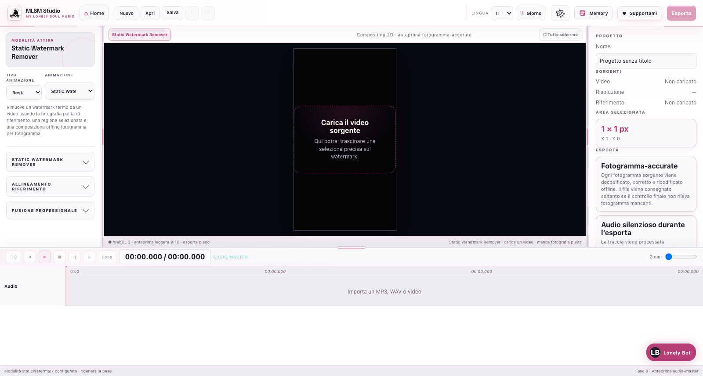

# Photo & Video Studio

## Static Watermark Remover

Rimuove un watermark fermo da un video di cui possiedi o sei autorizzato a modificare il contenuto.

1. Carica il video con watermark.
2. Carica una fotografia pulita della stessa inquadratura.
3. Disegna la regione nella preview.
4. Apri **Anteprima zona rimozione** per vedere anche i pixel confinanti, non soltanto il rettangolo sostituito.
5. Regola correzione e fusione; i valori iniziali sono conservativi.
6. Esporta: tutti i frame vengono decodificati, corretti e ricodificati offline.

**Sfumatura bordo** parte da `0%`: un valore maggiore interviene esclusivamente sulla stretta fascia esterna della zona trattata. **Intensità correzione** parte circa dal `5%` e armonizza luminosità/colore con il video senza sfocare i pixel puliti inseriti.

## Upscaler

Accetta fotografie e video. Per i video mostra avanzamento per frame e tile. I job
locali eliminano i frame temporanei allo scadere della finestra di consegna; i job remoti conservano i
checkpoint per poter riprendere un’elaborazione interrotta.

### Motori

| Modello | Ideale per | Limite principale |
| --- | --- | --- |
| **Canvas Enhanced** | Anteprima rapida e macchine senza backend AI | Non ricostruisce dettagli neurali. |
| **RealESRGAN x2plus** | Foto/video reali con ingrandimento moderato | Meno dettaglio del modello x4. |
| **RealESRGAN x4plus** | Scene reali, texture e dettagli generali | Più lento e più esigente. |
| **RealESRNet x4plus** | Restauro fedele e intervento meno aggressivo | Richiede servizio PyTorch locale. |
| **RealESRGAN x4plus anime 6B** | Anime, illustrazioni e cartoon | Non indicato per pelle/fotografia reale. |

Il dispositivo viene scelto automaticamente: CUDA su GPU NVIDIA, Metal/MPS su Apple Silicon, WebGPU nelle build browser e infine CPU/WASM. L’utente può forzare un motore diverso; i modelli che richiedono il servizio PyTorch locale restano disponibili solo quando quel servizio è raggiungibile.

### Upscaling remoto · Gradio / Colab

Attiva **Upscaling remoto** e aggiungi uno o più URL pubblici, per esempio
`https://abc123.gradio.live`. MLSM interroga ogni endpoint tramite
`/gradio_api/api/upscale_models`, mostra lo stato di ciascun Colab e rende
selezionabili soltanto i modelli disponibili in comune tra gli endpoint che
rispondono. Anche queste chiamate di discovery partono in parallelo, senza
attendere la risposta del Colab precedente. Sono supportati anche endpoint HTTPS compatibili con le stesse API;
gli URL privati/locali sono bloccati salvo l’esplicita modalità di sviluppo.
Se il coordinatore locale non è ancora disponibile, catalogo e upscaling delle
foto passano direttamente dalle API HTTPS di Gradio: l'interfaccia lo segnala
esplicitamente invece di mostrare il generico errore `Failed to fetch`. Per i
video il coordinatore locale resta necessario perché gestisce estrazione,
checkpoint su disco, distribuzione parallela dei frame e mux dell'audio.

Per una foto, MLSM prova gli endpoint attivi in failover. Per un video il
coordinatore locale estrae prima tutti i frame e avvia un worker seriale per ogni
endpoint: ogni Colab riceve quindi un solo frame alla volta, mentre endpoint
diversi lavorano realmente in parallelo. Durante il job la finestra di progresso
mostra tutti i worker, il frame assegnato e quante richieste sono
contemporaneamente in volo. Il risultato di ogni chiamata
`/gradio_api/call/upscale_image` viene scritto con rename atomico in
`.upscaler-cache/remote-video-jobs/<job>/upscaled-frames`. Un endpoint che cade
non annulla il lavoro degli altri; il frame viene riassegnato entro il limite di
tentativi impostato.

Se tutti gli endpoint diventano indisponibili, sorgente, frame originali e frame
già completati restano sul disco. Prima di ogni nuovo job remoto MLSM chiede
esplicitamente se **Riprendere la cache compatibile**, **Ripartire da zero** o
annullare. Il default tecnico del backend è sempre `restart`: nessun client può
riusare checkpoint in modo silenzioso. Scegliendo la ripresa, MLSM usa i frame
salvati soltanto quando SHA-256 dei byte e modello coincidono; un file diverso
crea sempre un job distinto. La ripresa continua dai soli frame mancanti anche
dopo il riavvio del servizio. Se tutti i frame sono già presenti, la
ricostruzione continua anche quando gli URL temporanei Colab sono scaduti. I checkpoint AI sono identificati dai byte del video e dal modello:
cambiare risoluzione finale, qualità o regolazioni non rimanda a Colab i frame
già completati, ma ripete soltanto rendering e mux locali. Se esiste già un MP4
verificato con la stessa configurazione, **Esporta** lo riaggancia immediatamente
senza avviare alcuna elaborazione. Al termine verifica che non manchi alcun frame, applica a ogni risultato remoto lo stesso preset di
esposizione, contrasto, colore, nitidezza e denoise scelto nell’interfaccia,
ricompone esattamente la sequenza al frame rate medio e alla durata della
sorgente, poi rimuxa l’audio originale con FFmpeg. Conteggio frame, durata,
geometria, decodificabilità e presenza audio vengono verificati prima di
dichiarare il job pronto. L’MP4 verificato
diventa immediatamente la sorgente della preview centrale senza sostituire o
perdere l’originale; **Esporta / salva MP4** lo scrive nel percorso scelto senza
rieseguire l’upscaling. La destinazione viene creata o sovrascritta soltanto
dopo il completamento di questi controlli, quindi un job fallito non lascia un
falso MP4 vuoto. Nell’app desktop il backend copia atomicamente il file
locale già ricostruito, evitando di trasferire centinaia di MB tramite IPC.
Il pannello remoto include **Svuota tutta la cache video**, con conferma: elimina
sorgenti, frame e risultati persistenti soltanto quando non esistono job attivi;
la directory radice resta intatta e i percorsi esterni non vengono mai toccati.
Le immagini inviate a Colab lasciano il computer: usa esclusivamente
endpoint di cui conosci il gestore.

### Flusso

1. Carica il media e seleziona modello/dispositivo.
2. Scegli **Prova** per un campione oppure **Genera upscaling** per l’intero file.
3. Segui download del modello e avanzamento frame/tile.
4. Confronta prima/dopo con separatore, zoom e pan.
5. Miscela l’originale ridimensionato con il risultato.
6. Regola esposizione, contrasto, bianchi, neri, saturazione, nitidezza e risoluzione finale.
7. Esporta dallo stesso pannello.

#### Batch foto

La sezione **Batch foto** mantiene una coda runtime separata dal progetto. Puoi
aggiungere più immagini, selezionare quelle da elaborare e scegliere una volta
la cartella di destinazione; modello, tile/TTA e tutte le regolazioni vengono
congelati all'avvio del job. Le immagini vengono processate in sequenza, con
target proporzionale per ogni sorgente quando **Mantieni proporzioni** è attivo
e con larghezza/altezza condivise quando è disattivato. Un errore su una foto
non interrompe le altre; puoi annullare la coda o riprovare soltanto le fallite.
Video e sorgente singola restano nel flusso Upscaler normale.

Caricare una nuova sorgente interrompe e sgancia immediatamente qualsiasi
export della sorgente precedente. Progressi, errori e risultati tardivi del
vecchio job non possono essere mostrati né adottati dal nuovo video.

Ogni foto resta visibile come miniatura nella galleria: fai clic sulla tessera
per caricarla nella preview principale (che, quando disponibile, mostra il
risultato AI accurato di quella foto) e usa la casella separata per decidere se
elaborarla. Le miniature applicano in tempo reale le regolazioni condivise,
anche con **Canvas Enhanced**, senza avviare un’inferenza AI; la selezione della
miniatura è distinta dalla selezione di processing, resta solo runtime e non
modifica il progetto. La coda e le selezioni vengono azzerate quando crei un
progetto con **New** o ne apri uno con **Open**.

La preview video confronta i due risultati reali con le etichette **Originale** e
**Output**; non è una simulazione geometrica. Per i video il backend legge con
`ffprobe` il rapporto di visualizzazione (DAR), la rotazione e il pixel aspect
ratio (SAR), così l’orientamento e le proporzioni visibili restano coerenti anche
quando i metadati non coincidono con le dimensioni codificate.

I preset Full HD, QHD, 4K e 8K rispettano l’orientamento: un sorgente verticale resta verticale quando **Mantieni proporzioni** è attivo.

All’import, **Mantieni proporzioni** usa il rapporto reale della sorgente; i preset si adattano quindi a quel rapporto senza forzare 16:9 o 9:16. La stessa regola vale in esportazione. Disattivando il blocco puoi impostare liberamente larghezza e altezza personalizzate, anche con un rapporto diverso da quello originale.

L’output viene rasterizzato con pixel quadrati (`SAR 1:1`), mantenendo il DAR
corretto senza introdurre stretching nei player che ignorano i metadati SAR.

## Frame Booster standalone

**Frame Booster** è disponibile anche come modalità separata in Photo & Video
Studio (oltre che nell’export del Video Editor). Accetta esclusivamente video,
mantiene rapporto, orientamento/rotazione, durata e audio della sorgente e
consegna il risultato solo dopo un audit di FPS, durata, frame, DAR, dimensioni
e audio. Il file originale viene sempre preservato.

Puoi scegliere **Blend**, **Motion** (FFmpeg) o **RIFE** e impostare un
moltiplicatore oppure un FPS target. Il job mostra l’avanzamento e può essere
annullato; un errore non viene convertito in un fallback silenzioso.

RIFE usa il runtime ufficiale Practical-RIFE v4.26 di `hzwer`, preparato on
demand dal manifest con revision SHA fissata e checksum SHA-256. Il dispositivo
automatico seleziona CUDA su NVIDIA, MPS su Apple Silicon e CPU solo se
esplicitamente scelto o come opzione compatibile; MPS usa FP32, CUDA può usare
FP16/FP32. Prima di eseguire RIFE viene effettuato un self-test reale del runtime.
