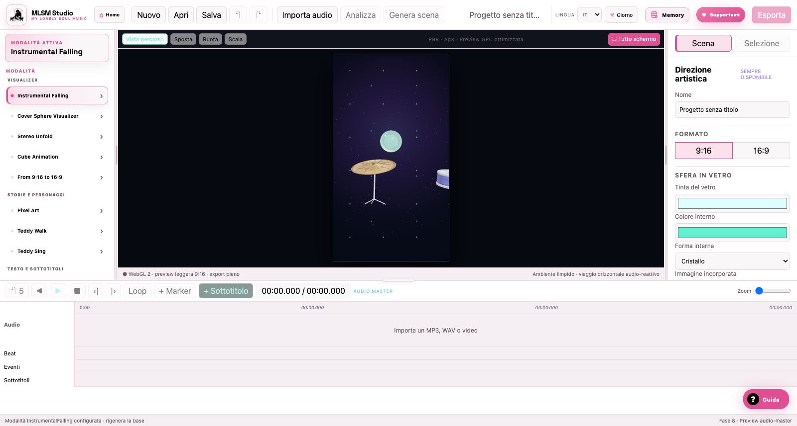

# Sound Animation

L’area raccoglie visualizer, storie e tipografia sincronizzati all’audio.

## Visualizer

| Modalità | Input | Risultato e controlli chiave |
| --- | --- | --- |
| **Instrumental Falling** | Audio, cover interna opzionale, sfondo foto/video | Biglia di vetro su strumenti, cadute e binari; materiali, luci, traiettoria, oggetti e finale modificabili. |
| **Cover Sphere Visualizer** | Audio, cover, sfondo | Cover realmente incorporata nella sfera, rotazione fluida, 48 bande, pioggia, fumo, foglie, particelle e palette. |
| **Stereo Unfold** | Audio e cover | Cover stropicciata che si apre; barre stereo laterali ed effetti full-screen davanti alla cover. |
| **Cube Animation** | Audio, cover e sfondo separato | Cubo in vetro che ruota sui tre assi, spettrogramma e increspature d’acqua audio-reattive. |
| **From 9:16 to 16:9** | Video verticale, immagine laterale, cover | Video intero al centro; lati specchiati, 48 bande stereo, cubo, pioggia, fulmini, piume e particelle come livelli riordinabili. |
| **Background Auto Animation** | Immagine, audio | DETR locale elenca gli oggetti una sola volta e salva riquadri normalizzati e palette nel progetto; l’utente sceglie l’alias visualizzato, corregge **Person** se necessario e seleziona esplicitamente **Animate** per applicare un effetto. Più effetti **Circular Spectrum** possono essere associati a oggetti diversi e ruotano indipendentemente, con intensità, scala, opacità (0–100%, predefinita 90%), velocità (0–1 rev/s, predefinita 0,08; anche 0 per fermare) e collision particles configurabili. Ogni effetto può attivare/disattivare separatamente lo spettro centrale, le animazioni stereo laterali e i sottotitoli. Lo spettro centrale è una barra orizzontale fissa dentro il cerchio; i canali sinistro/destro reagiscono ai rispettivi dati stereo leggermente sotto di essa ai due lati. Se abilitati, i Pro Subtitles usano le cue condivise e percorrono il cerchio dal basso verso l’alto, ruotando e dissolvendosi con la palette automatica. Ogni oggetto usa una palette estratta dalla propria immagine, con tre colori selezionabili in modalità automatica o manuale; il compositing `source-over` ne conserva i tre colori. Preview ed export condividono lo stesso renderer e gli stessi tempi. |

Il rilevamento usa `Xenova/detr-resnet-50` con cache lazy WebGPU→WASM. I risultati vengono persistiti: preview ed export offline non rieseguono l’AI.

DETR usa il vocabolario chiuso COCO. La sensibilità è regolabile (soglia predefinita 0,15); **Detect again** avvia esplicitamente una nuova analisi. I duplicati vengono soppressi tenendo conto della classe, con un massimo di 256 rilevamenti salvati.

L’immagine caricata è la fonte di verità per il rapporto: preview ed export la mostrano in modalità `contain`, senza crop. Sono validi preset proporzionali arbitrari, anche se non appartengono all’elenco predefinito. Gli overlay diagnostici della preview mostrano riquadro, alias, etichetta del modello e confidence, ma non vengono inclusi nell’export. L’assenza di una persona produce solo un avviso; non blocca automaticamente l’export.

La sorgente viene resa fedelmente, senza velo scuro o vignettatura automatica. Il pulsante **Show/Hide detected areas** controlla solo gli overlay dell’editor: nasconderli non modifica il canvas né l’export. La sidebar dei controlli si adatta alle larghezze ridotte della finestra.

## Storie e personaggi

| Modalità | Input | Risultato e controlli chiave |
| --- | --- | --- |
| **Teddy Walk** | Audio e cover | Orsacchiotto usurato che cammina; cover pulsante nello squarcio sul petto e ballo opzionale. |
| **Teddy Sing** | Audio o voce isolata e poster | Primo piano dell’orso afflosciato al muro, lip sync 3D, fonemi editabili e particelle atmosferiche. |

## Testo e sottotitoli

| Modalità | Input | Risultato e controlli chiave |
| --- | --- | --- |
| **Pro Subtitles** | Video, SRT oppure audio+Whisper, immagine palette | Kinetic typography per parola; posizione, font, dimensione, opacità, ombra e animazione globali o locali; export trasparente o video completo. |
| **Pixels Subtitles** | Audio, cover e sottotitoli | Cover protetta al centro; pixel ritmici ai lati e tipografia pixel leggibile con palette/ombra configurabili. |

## Sottotitoli condivisi

Le modalità abilitate usano gli stessi blocchi della timeline. Puoi importare SRT/WebVTT, generare con Whisper, revisionare con agenti locali, modificare testo e timing, aggiungere blocchi manuali, salvare preset e riesportare SRT.
